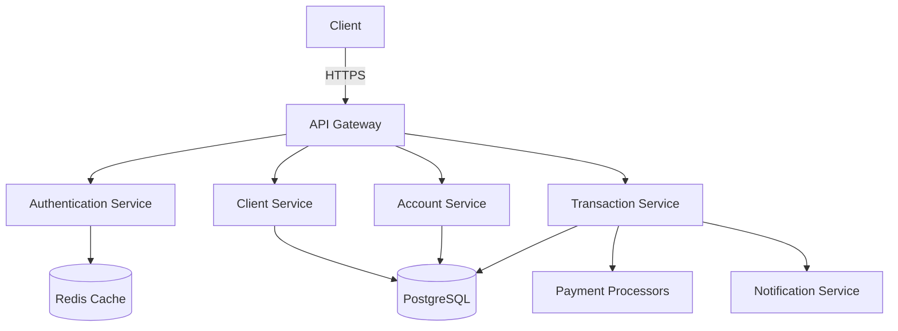

# Architecture Overview

## System Architecture

### High-Level Components

### Technology Stack

| Component          | Technology               | Purpose                          |
|--------------------|--------------------------|----------------------------------|
| API Gateway        | Nginx                    | Request routing, load balancing   |
| Backend Services  | Go (Gin framework)       | Business logic implementation    |
| Database          | PostgreSQL 14+           | Primary data storage             |
| Cache             | Redis 7.0+              | Session storage, rate limiting   |
| Message Queue     | RabbitMQ                 | Asynchronous task processing     |
| Search            | Elasticsearch           | Full-text and complex searches   |
| Monitoring        | Prometheus + Grafana     | System monitoring               |
| Logging           | ELK Stack               | Centralized logging             |
| Containerization  | Docker + Kubernetes     | Deployment and orchestration    |

## Design Principles

### 1. Microservices Architecture
- **Service Decomposition**: System is broken down into loosely coupled services
- **Independent Deployment**: Each service can be deployed independently
- **Technology Agnostic**: Services can use different technologies as needed

### 2. Domain-Driven Design (DDD)
- **Bounded Contexts**: Clear separation of concerns
- **Ubiquitous Language**: Common language across teams
- **Aggregate Roots**: Clear consistency boundaries

### 3. Event-Driven Architecture
- **Asynchronous Communication**: Using message queues
- **Event Sourcing**: For critical business events
- **CQRS**: Separate read and write models

## Service Communication

### Synchronous (HTTP/REST)
- Service-to-service communication
- Request/Response pattern
- Used for immediate operations

### Asynchronous (Message Queue)
- Event-based communication
- Pub/Sub pattern
- Used for background processing

## Data Management

### Database Per Service
- Each service owns its data
- No direct database sharing
- API-based access only

### Data Consistency
- Eventual consistency for distributed transactions
- Saga pattern for long-running transactions
- Compensating transactions for rollbacks

## Security Architecture

### Authentication
- OAuth 2.0 / OpenID Connect
- JWT for stateless authentication
- Short-lived access tokens with refresh tokens

### Authorization
- Role-Based Access Control (RBAC)
- Fine-grained permissions
- Attribute-Based Access Control (ABAC) where needed

### Data Protection
- Encryption at rest (AES-256)
- Encryption in transit (TLS 1.3+)
- Secrets management using HashiCorp Vault

## Scalability

### Horizontal Scaling
- Stateless services
- Database read replicas
- Caching strategy

### Performance Optimization
- Database indexing
- Query optimization
- Connection pooling

## Reliability

### Fault Tolerance
- Circuit breakers
- Retry policies
- Bulkhead pattern

### High Availability
- Multi-AZ deployment
- Auto-scaling
- Self-healing

## Monitoring and Observability

### Metrics
- Service health
- Performance metrics
- Business metrics

### Logging
- Structured logging
- Correlation IDs
- Log levels

### Tracing
- Distributed tracing
- Performance analysis
- Root cause analysis

## Deployment Architecture

### Infrastructure as Code
- Terraform for provisioning
- Ansible for configuration
- GitOps workflow

### CI/CD Pipeline
- Automated testing
- Canary deployments
- Blue/green deployments

## Related Documents
- [System Components](011-SYSTEM-COMPONENTS.md)
- [Data Flow](012-DATA-FLOW.md)
- [API Gateway](013-API-GATEWAY.md)
- [Service Communication](014-SERVICE-COMMUNICATION.md)
- [Scalability](015-SCALABILITY.md)
- [Security Architecture](016-SECURITY-ARCHITECTURE.md)
