# Data Flow Architecture

## Overview
This document outlines how data moves through the Global Remit system, including request/response flows, event propagation, and data synchronization between services.

## Request/Response Flow

### 1. Client Authentication
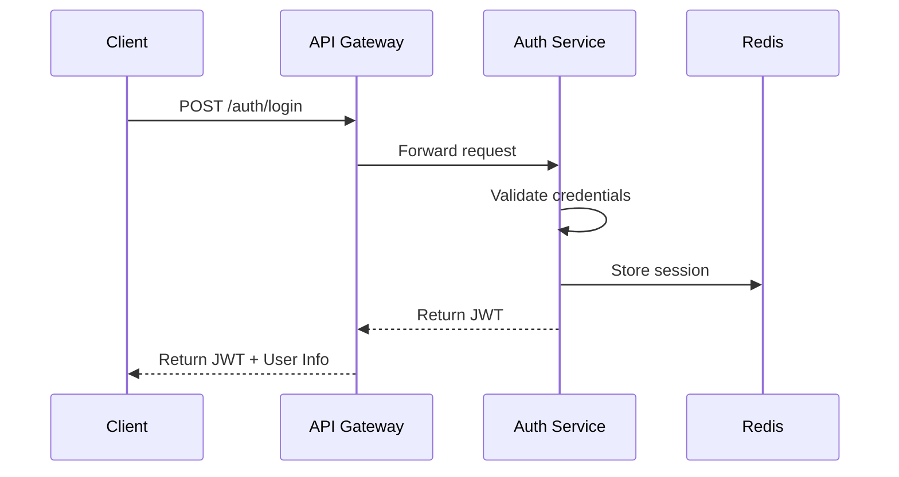

### 2. Client Profile View
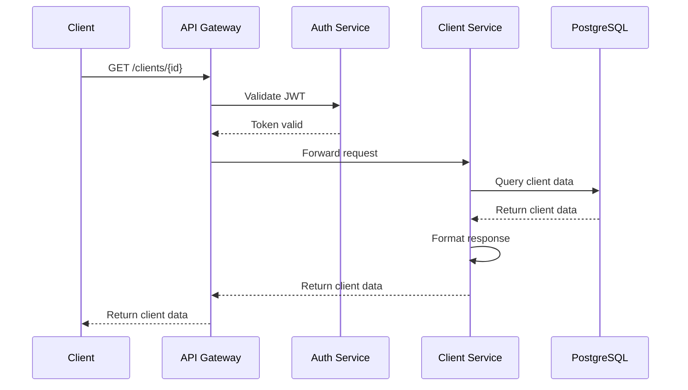

## Event-Driven Flows

### 1. Money Transfer
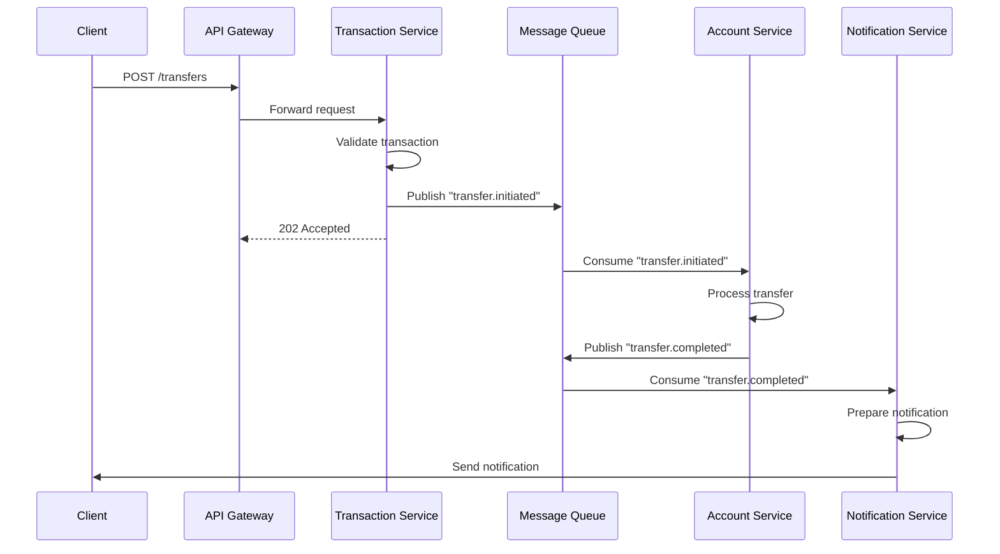

### 2. Client KYC Verification
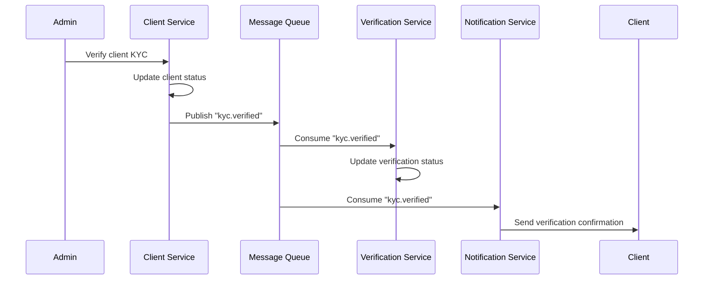

## Data Synchronization

### 1. Read Model Updates
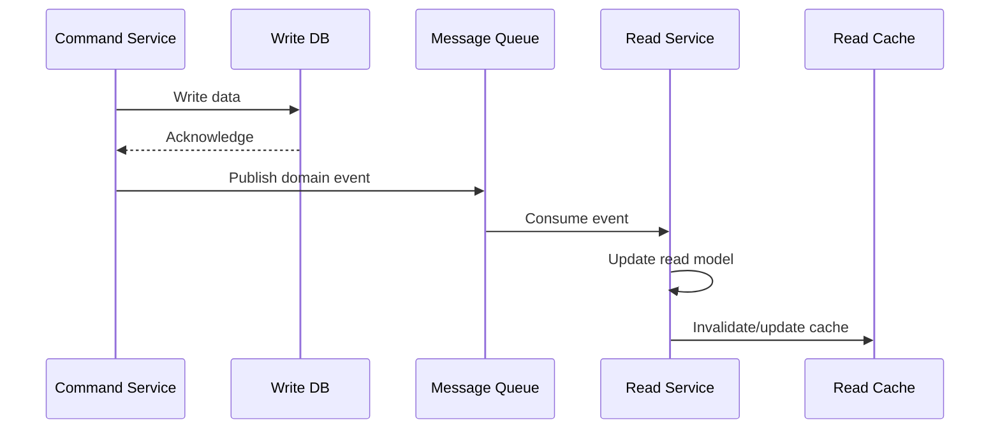

### 2. Cross-Service Data Consistency
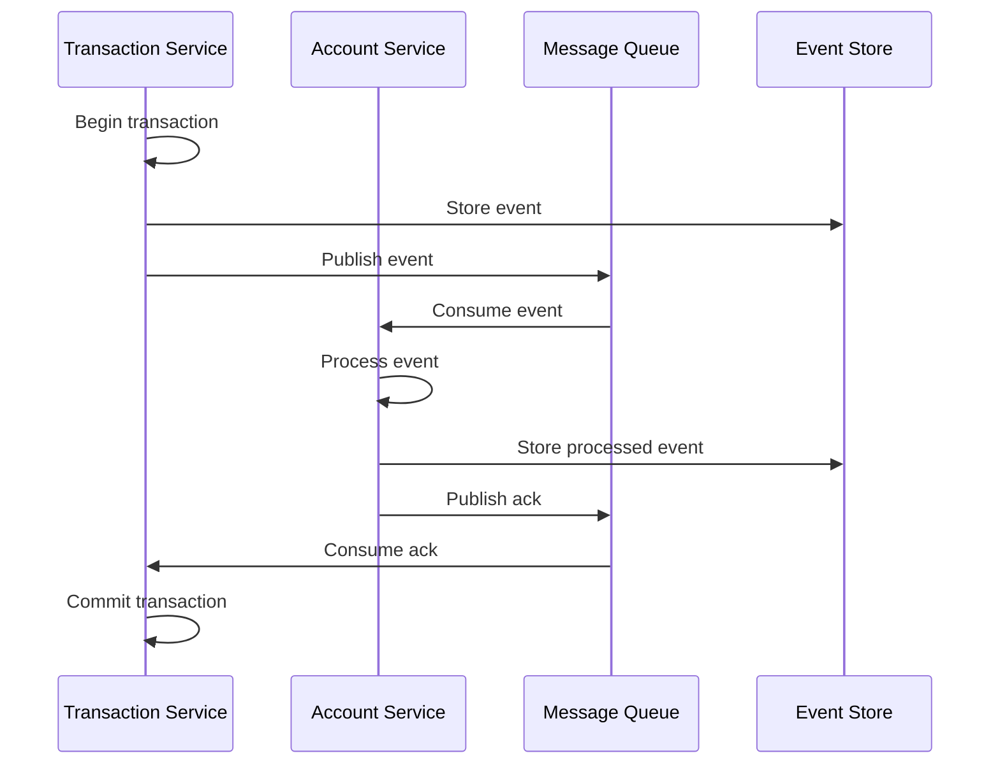

## Caching Strategy

### 1. Read-Through Cache
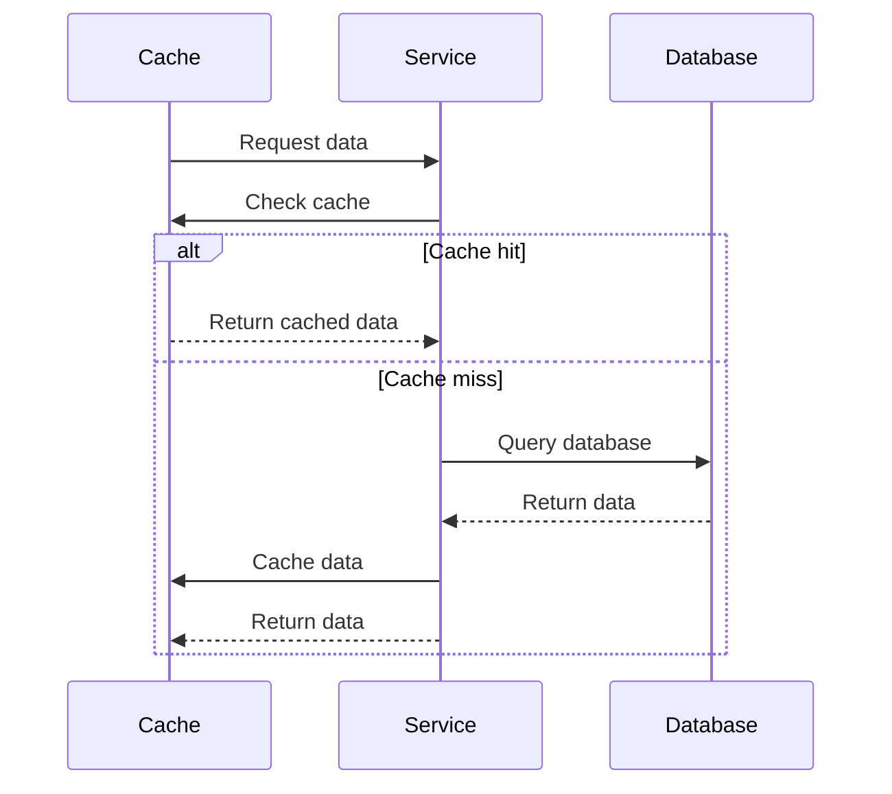

### 2. Write-Through Cache
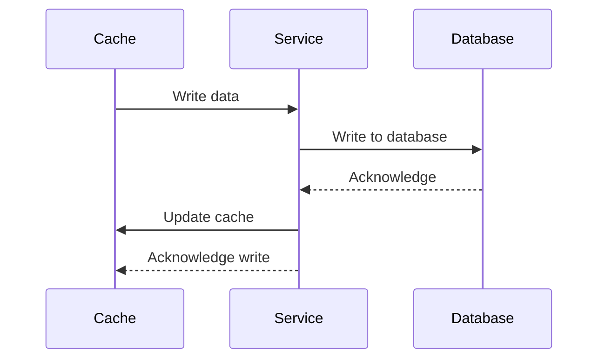

## Error Handling Flows

### 1. Retry Mechanism
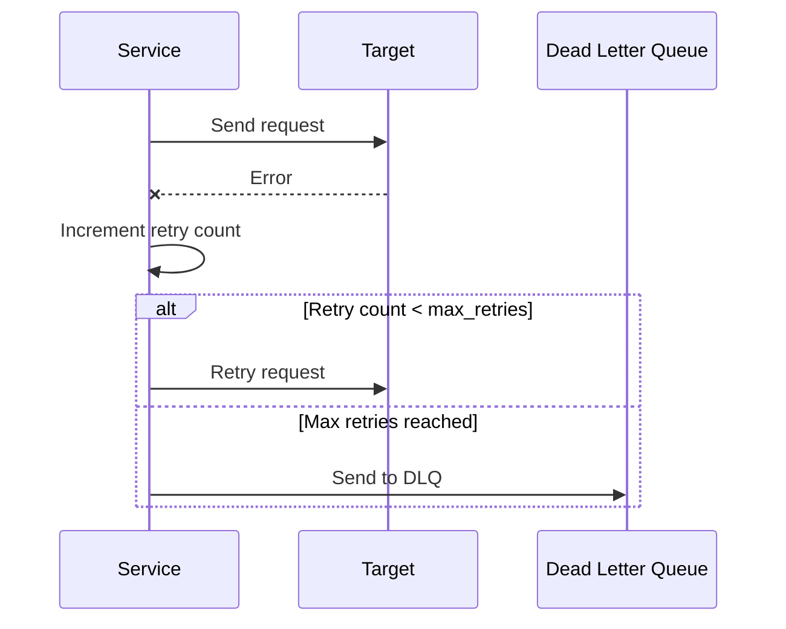

### 2. Circuit Breaker
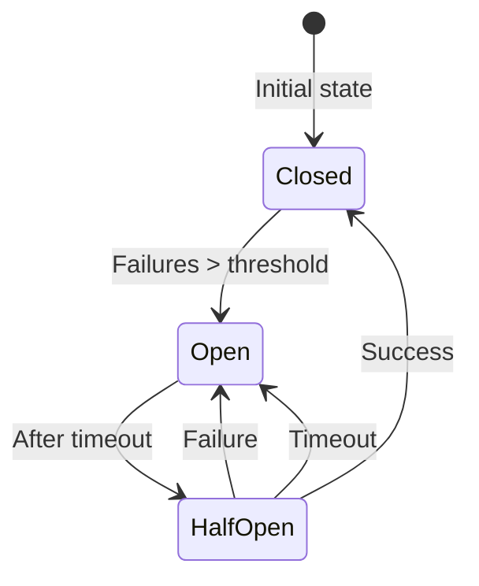

## Performance Considerations

### 1. Request Batching
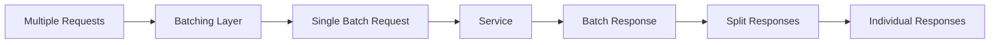

### 2. Data Pagination
```graphql
type Query {
  transactions(
    first: Int
    after: String
    last: Int
    before: String
  ): TransactionConnection
}

type TransactionConnection {
  edges: [TransactionEdge]
  pageInfo: PageInfo!
}

type TransactionEdge {
  node: Transaction!
  cursor: String!
}

type PageInfo {
  hasNextPage: Boolean!
  hasPreviousPage: Boolean!
  startCursor: String
  endCursor: String
}
```

## Security Flows

### 1. Authentication Flow
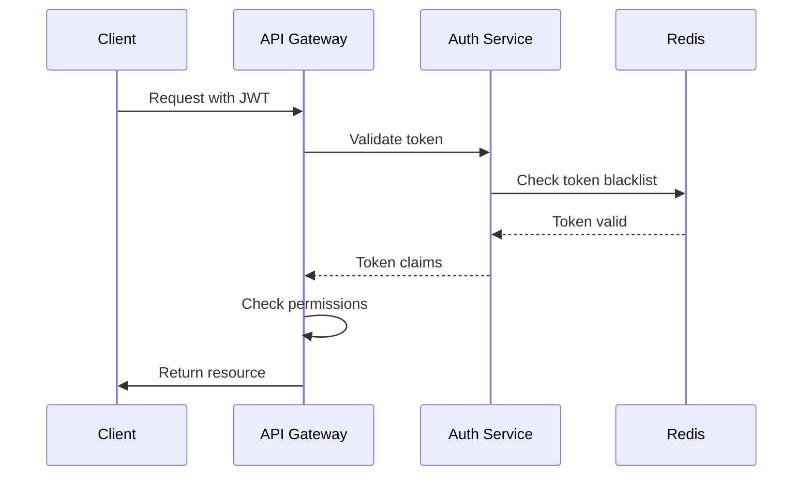

### 2. Data Encryption
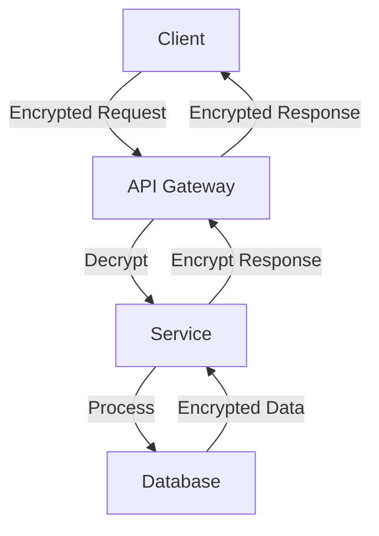

## Monitoring and Logging

### 1. Distributed Tracing
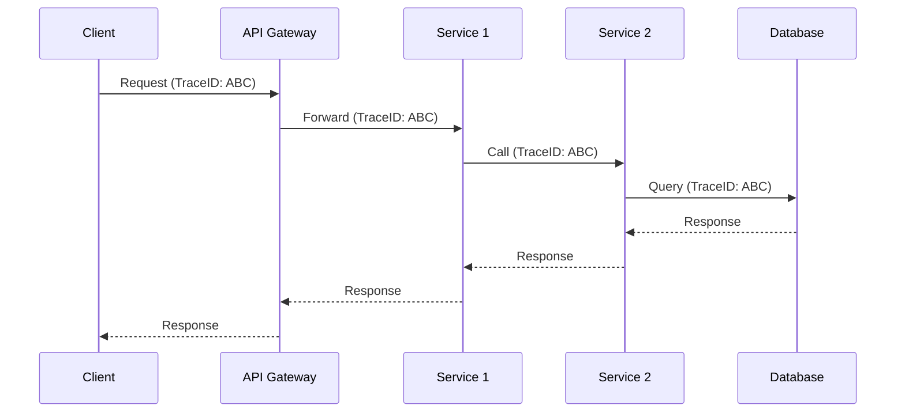

## Related Documents
- [System Components](011-SYSTEM-COMPONENTS.md)
- [API Gateway](013-API-GATEWAY.md)
- [Service Communication](014-SERVICE-COMMUNICATION.md)
- [Scalability](015-SCALABILITY.md)
