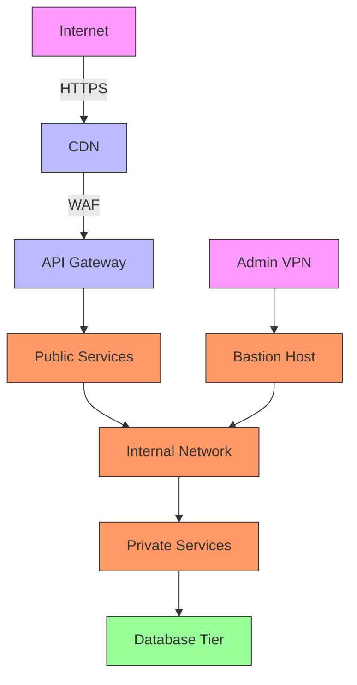

# Security Architecture

## Table of Contents
- [Overview](#overview)
- [Security Principles](#security-principles)
- [Network Security](#network-security)
- [Application Security](#application-security)
- [Data Security](#data-security)
- [Identity and Access Management](#identity-and-access-management)
- [Compliance and Governance](#compliance-and-governance)
- [Incident Response](#incident-response)
- [Security Testing](#security-testing)
- [Related Documents](#related-documents)

## Overview

This document outlines the security architecture for the Global Remit platform, ensuring the confidentiality, integrity, and availability of all systems and data. The architecture follows a defense-in-depth approach with multiple layers of security controls.

## Security Principles

### 1. Zero Trust Model
- **Verify Explicitly**: Always authenticate and authorize based on all available data points
- **Least Privilege**: Limit user access with just-in-time and just-enough-access
- **Assume Breach**: Minimize blast radius and segment access

### 2. Secure by Design
- Security requirements defined during design phase
- Threat modeling for all components
- Secure coding practices and standards

### 3. Defense in Depth
- Multiple layers of security controls
- Redundant security measures
- Fail-secure defaults

## Network Security

### Network Segmentation

### DDoS Protection
- Cloud provider DDoS protection
- Rate limiting at edge
- Web Application Firewall (WAF) rules

### Network Access Control
- VPC peering with private subnets
- Security groups and network ACLs
- VPN access with MFA for administrative access

## Application Security

### Authentication
- OAuth 2.0 with OpenID Connect
- Multi-factor authentication (MFA) for all users
- Passwordless authentication options
- Session management with secure, HttpOnly, SameSite cookies

### Authorization
- Role-Based Access Control (RBAC)
- Attribute-Based Access Control (ABAC)
- Policy as Code for infrastructure

### Input Validation
- Strong input validation on all endpoints
- Content Security Policy (CSP)
- Regular expression validation
- Output encoding

### API Security
- Rate limiting and throttling
- Request validation
- API versioning
- Comprehensive logging of API calls

## Data Security

### Encryption
- **In Transit**: TLS 1.3 for all communications
- **At Rest**: AES-256 encryption
- **Key Management**: Hardware Security Modules (HSM)

### Data Classification
| Data Type | Classification | Encryption | Access Control |
|-----------|----------------|------------|----------------|
| PII       | High           | Required   | Strict         |
| Financial | High           | Required   | Strict         |
| Logs      | Medium         | Optional   | Standard       |
| Metadata  | Low            | Optional   | Standard       |

### Data Retention
- Automatic data retention policies
- Secure deletion procedures
- Backup encryption

## Identity and Access Management

### User Management
- Centralized identity provider
- Just-in-time provisioning
- Regular access reviews

### Service Accounts
- Short-lived credentials
- Automatic rotation
- Limited permissions

### Privileged Access
- Just-in-time elevation
- Session recording
- Approval workflows

## Compliance and Governance

### Regulatory Compliance
- PCI DSS for payment processing
- GDPR for data protection
- SOC 2 Type II certification
- Local financial regulations

### Security Policies
- Documented security policies
- Regular policy reviews
- Employee training and awareness

## Incident Response

### Monitoring and Detection
- SIEM integration
- Anomaly detection
- Real-time alerting

### Response Plan
- Documented incident response plan
- Defined roles and responsibilities
- Communication plan
- Post-incident review process

### Forensics
- Log retention policy
- Chain of custody
- Evidence preservation

## Security Testing

### Automated Scanning
- SAST (Static Application Security Testing)
- DAST (Dynamic Application Security Testing)
- Container scanning
- Dependency scanning

### Penetration Testing
- Regular third-party assessments
- Bug bounty program
- Internal red team exercises

## Related Documents
- [Architecture Overview](010-ARCHITECTURE-OVERVIEW.md)
- [System Components](011-SYSTEM-COMPONENTS.md)
- [Service Communication](014-SERVICE-COMMUNICATION.md)
- [Scalability](015-SCALABILITY.md)
- [Error Handling Strategy](017-ERROR-HANDLING-STRATEGY.md)
- [Logging Strategy](018-LOGGING-STRATEGY.md)
- [Monitoring Strategy](019-MONITORING-STRATEGY.md)

---
*Last updated: June 20, 2025*
