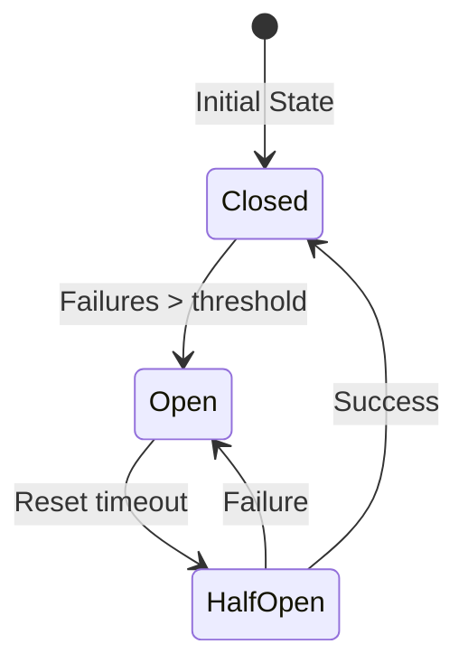

# Error Handling Strategy

## Table of Contents
- [Overview](#overview)
- [Error Classification](#error-classification)
- [Error Response Format](#error-response-format)
- [Error Logging](#error-logging)
- [Error Recovery](#error-recovery)
- [Retry Mechanisms](#retry-mechanisms)
- [Circuit Breaker Pattern](#circuit-breaker-pattern)
- [Monitoring and Alerting](#monitoring-and-alerting)
- [Error Tracking](#error-tracking)
- [Related Documents](#related-documents)

## Overview

This document outlines the error handling strategy for the Global Remit platform, ensuring consistent and reliable error management across all services. The strategy focuses on providing meaningful error messages, enabling quick debugging, and maintaining system stability.

## Error Classification

### 1. Client Errors (4xx)
| Status Code | Error Code | Description |
|-------------|------------|-------------|
| 400 | BAD_REQUEST | Invalid request parameters |
| 401 | UNAUTHORIZED | Authentication required |
| 403 | FORBIDDEN | Insufficient permissions |
| 404 | NOT_FOUND | Resource not found |
| 409 | CONFLICT | Resource conflict |
| 422 | UNPROCESSABLE_ENTITY | Validation failed |
| 429 | TOO_MANY_REQUESTS | Rate limit exceeded |

### 2. Server Errors (5xx)
| Status Code | Error Code | Description |
|-------------|------------|-------------|
| 500 | INTERNAL_ERROR | Unexpected server error |
| 501 | NOT_IMPLEMENTED | Feature not implemented |
| 502 | BAD_GATEWAY | Invalid response from upstream |
| 503 | SERVICE_UNAVAILABLE | Service temporarily unavailable |
| 504 | GATEWAY_TIMEOUT | Upstream timeout |

### 3. Business Logic Errors
| Error Code | HTTP Status | Description |
|------------|-------------|-------------|
| INSUFFICIENT_FUNDS | 400 | Account has insufficient funds |
| TRANSACTION_LIMIT_EXCEEDED | 400 | Transaction amount exceeds limit |
| DAILY_LIMIT_REACHED | 400 | Daily transaction limit reached |
| INVALID_RECIPIENT | 400 | Recipient details are invalid |
| SENDER_BLOCKED | 403 | Sender account is blocked |
| RECIPIENT_BLOCKED | 400 | Recipient account is blocked |
| DUPLICATE_TRANSACTION | 409 | Duplicate transaction detected |
| MAINTENANCE_MODE | 503 | Service under maintenance |

## Error Response Format

### Standard Error Response
```json
{
  "error": {
    "code": "INSUFFICIENT_FUNDS",
    "message": "Account has insufficient funds for this transaction",
    "status": 400,
    "details": {
      "available_balance": 1500.00,
      "required_amount": 2000.00,
      "currency": "USD"
    },
    "request_id": "req_1234567890abcdef",
    "timestamp": "2025-06-20T13:00:00Z",
    "documentation_url": "https://docs.globalremit.com/errors/INSUFFICIENT_FUNDS"
  }
}
```

### Validation Error Example
```json
{
  "error": {
    "code": "VALIDATION_ERROR",
    "message": "Request validation failed",
    "status": 422,
    "details": [
      {
        "field": "amount",
        "message": "Must be greater than 0",
        "value": -100
      },
      {
        "field": "recipient.email",
        "message": "Must be a valid email address",
        "value": "invalid-email"
      }
    ],
    "request_id": "req_1234567890abcdef"
  }
}
```

## Error Logging

### Log Structure
```json
{
  "level": "error",
  "timestamp": "2025-06-20T13:00:00Z",
  "request_id": "req_1234567890abcdef",
  "session_id": "sess_abcdef123456",
  "user_id": "user_12345",
  "service": "transaction-service",
  "endpoint": "POST /api/v1/transactions",
  "error_code": "INSUFFICIENT_FUNDS",
  "error_message": "Account has insufficient funds for this transaction",
  "stack_trace": "...",
  "context": {
    "account_id": "acc_12345",
    "amount": 2000.00,
    "currency": "USD",
    "available_balance": 1500.00
  },
  "environment": "production",
  "version": "1.2.3"
}
```

### Log Levels
| Level | When to Use |
|-------|-------------|
| ERROR | Action needed, operation failed |
| WARN  | Unusual situation, but system continues |
| INFO  | Normal operational messages |
| DEBUG | Detailed information for debugging |
| TRACE | Very detailed debugging information |

## Error Recovery

### Automatic Recovery
- **Transient Errors**: Automatic retry with exponential backoff
- **Database Deadlocks**: Automatic retry with jitter
- **Network Timeouts**: Circuit breaker pattern

### Manual Recovery
- **Data Corruption**: Manual intervention required
- **Security Incidents**: Security team notification
- **Critical Failures**: Escalation to on-call engineer

## Retry Mechanisms

### Retry Policy
```yaml
max_attempts: 3
initial_delay: 100ms
max_delay: 1s
multiplier: 2
jitter: 0.2
retryable_errors:
  - "NETWORK_ERROR"
  - "TIMEOUT"
  - "SERVICE_UNAVAILABLE"
  - "GATEWAY_TIMEOUT"
  - "TOO_MANY_REQUESTS"
```

### Idempotency
- All mutating operations are idempotent
- Idempotency keys for all POST/PUT/PATCH/DELETE requests
- 24-hour idempotency window

## Circuit Breaker Pattern

### States


### Configuration
```yaml
failure_threshold: 5
success_threshold: 3
reset_timeout: 30s
timeout: 1s
```

## Monitoring and Alerting

### Key Metrics
- Error rate by service/endpoint
- Error rate by error code
- P50/P90/P99 error response times
- Success/failure ratio
- Circuit breaker state changes

### Alert Thresholds
| Metric | Warning | Critical |
|--------|---------|----------|
| Error Rate | > 1% | > 5% |
| 5xx Errors | > 0.5% | > 2% |
| 4xx Errors | > 5% | > 10% |
| Latency P99 | > 1s | > 3s |

## Error Tracking

### Integration
- Sentry for application errors
- DataDog for infrastructure errors
- PagerDuty for on-call alerts
- JIRA for issue tracking

### Workflow
1. Error occurs and is logged
2. Alert triggered if threshold exceeded
3. Incident created in PagerDuty
4. On-call engineer investigates
5. Bug created in JIRA if needed
6. Fix deployed
7. Post-mortem for critical issues

## Related Documents
- [Architecture Overview](010-ARCHITECTURE-OVERVIEW.md)
- [System Components](011-SYSTEM-COMPONENTS.md)
- [Service Communication](014-SERVICE-COMMUNICATION.md)
- [Scalability](015-SCALABILITY.md)
- [Security Architecture](016-SECURITY-ARCHITECTURE.md)
- [Logging Strategy](018-LOGGING-STRATEGY.md)
- [Monitoring Strategy](019-MONITORING-STRATEGY.md)

---
*Last updated: June 20, 2025*
