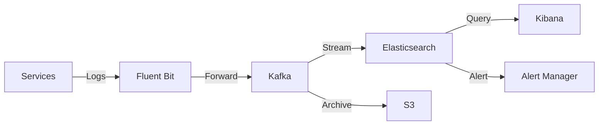

# Logging Strategy

## Table of Contents
- [Overview](#overview)
- [Log Levels](#log-levels)
- [Log Format](#log-format)
- [Structured Logging](#structured-logging)
- [Log Categories](#log-categories)
- [Log Retention](#log-retention)
- [Log Aggregation](#log-aggregation)
- [Log Analysis](#log-analysis)
- [Log Alerting](#log-alerting)
- [Security Considerations](#security-considerations)
- [Performance Considerations](#performance-considerations)
- [Related Documents](#related-documents)

## Overview

This document defines the logging strategy for the Global Remit platform, ensuring consistent, secure, and effective logging across all services. The strategy balances the need for detailed information with performance and security requirements.

## Log Levels

### Standard Log Levels
| Level | When to Use | Example |
|-------|-------------|---------|
| **FATAL** | System is unusable | Application cannot start due to configuration error |
| **ERROR** | Runtime errors that need attention | Failed transaction, database connection lost |
| **WARN** | Unusual but not an error | Approaching rate limit, deprecated API usage |
| **INFO** | Important business events | User login, transaction processed |
| **DEBUG** | Detailed information for debugging | Request/response payloads, state changes |
| **TRACE** | Very detailed debugging information | Function entry/exit, detailed variable dumps |

### Environment-Specific Log Levels
| Environment | Minimum Level | Notes |
|-------------|---------------|-------|
| Production | INFO | Debug and Trace only for specific sessions |
| Staging | DEBUG | Full debug logging |
| Development | TRACE | Maximum verbosity |
| Testing | WARN | Only warnings and above |

## Log Format

### Text Format (Development)
```
2025-06-20T13:00:00.000Z INFO  [transaction-service] [req-1234] Processed transaction 
  tx_id=txn_7890abc 
  amount=100.00 
  currency=USD 
  duration=45ms
```

### JSON Format (Production)
```json
{
  "timestamp": "2025-06-20T13:00:00.000Z",
  "level": "INFO",
  "service": "transaction-service",
  "environment": "production",
  "version": "1.2.3",
  "trace_id": "trace-1234",
  "span_id": "span-5678",
  "request_id": "req-1234",
  "session_id": "sess-5678",
  "user_id": "user_12345",
  "message": "Processed transaction",
  "tx_id": "txn_7890abc",
  "amount": 100.00,
  "currency": "USD",
  "duration_ms": 45,
  "tags": ["transaction", "processing"]
}
```

## Structured Logging

### Common Fields
| Field | Type | Required | Description |
|-------|------|----------|-------------|
| timestamp | ISO8601 | Yes | Event timestamp with millisecond precision |
| level | string | Yes | Log level (FATAL, ERROR, WARN, INFO, DEBUG, TRACE) |
| service | string | Yes | Service name (e.g., "transaction-service") |
| environment | string | Yes | Environment (production, staging, development) |
| version | string | Yes | Service version |
| message | string | Yes | Human-readable message |
| request_id | string | No | Unique request identifier |
| trace_id | string | No | Distributed tracing ID |
| span_id | string | No | Span ID for distributed tracing |
| user_id | string | No | Authenticated user ID |
| session_id | string | No | User session ID |
| duration_ms | number | No | Operation duration in milliseconds |
| error | object | No | Error details (for ERROR/FATAL levels) |
| stack_trace | string | No | Stack trace (for errors) |
| context | object | No | Additional context data |

### Contextual Logging
```go
// Example in Go
logger.Info("Processing transaction",
    log.String("tx_id", txID),
    log.Float64("amount", amount),
    log.String("currency", currency),
    log.Duration("duration", duration),
    log.Object("user", log.String("id", userID)),
    log.String("status", "completed"),
)
```

## Log Categories

### Application Logs
- **Request Logs**: Incoming HTTP requests/responses
- **Business Logic**: Key business events and transactions
- **Authentication**: Login attempts, token validations
- **Authorization**: Permission checks, access denied events

### System Logs
- **Startup/Shutdown**: Service initialization and termination
- **Health Checks**: Liveness/readiness probe results
- **Configuration**: Configuration loading and changes

### Security Logs
- **Authentication**: Failed login attempts, password changes
- **Authorization**: Permission denied events
- **Data Access**: Sensitive data access
- **Security Events**: Potential security incidents

## Log Retention

### Retention Periods
| Log Type | Retention Period | Storage | Notes |
|----------|------------------|---------|-------|
| Application Logs | 30 days | Hot Storage | Indexed for search |
| Audit Logs | 1 year | Warm Storage | Compliance requirement |
| Security Logs | 2 years | Cold Storage | Legal requirement |
| Debug Logs | 7 days | Hot Storage | Development only |
| Access Logs | 90 days | Warm Storage | Traffic analysis |

### Storage Tiers
1. **Hot Storage (0-7 days)**: Immediate access, full search
2. **Warm Storage (8-90 days):** Slower access, limited search
3. **Cold Storage (90+ days):** Archived, retrieval delay

## Log Aggregation

### Centralized Logging Architecture


### Log Collection
- **Containers**: Fluent Bit sidecar containers
- **Servers**: Filebeat agents
- **Kubernetes**: DaemonSet for cluster-wide logging

## Log Analysis

### Common Queries
```sql
-- Errors in the last hour
level:ERROR AND @timestamp:[now-1h TO now]

-- Slow transactions
duration_ms:>1000 AND message:"Processed transaction"

-- Failed logins by user
message:"Failed login" | stats count by user_id

-- Most frequent errors
level:ERROR | stats count by error.message | sort -count
```

### Log Patterns
- **Error Rate**: Track error frequency over time
- **Latency**: Identify slow operations
- **Usage**: Monitor feature usage patterns
- **Anomalies**: Detect unusual patterns

## Log Alerting

### Alert Conditions
| Condition | Severity | Notification |
|-----------|----------|--------------|
| ERROR log in production | High | PagerDuty (Immediate) |
| WARN log rate > 10/min | Medium | Email |
| FATAL log | Critical | PagerDuty (Immediate) |
| Log ingestion stopped | High | PagerDuty |
| Sensitive data detected | High | Security Team |

### Alert Enrichment
- Add service owner information
- Include runbook links
- Add severity levels
- Include relevant context

## Security Considerations

### Sensitive Data
- **Never log**: Passwords, API keys, tokens, PII
- **Redact**: Partial account numbers, emails, IPs
- **Mask**: Replace sensitive values with [REDACTED]

### Access Control
- Role-based access to logs
- Audit logging for log access
- Encryption in transit and at rest

## Performance Considerations

### Logging Best Practices
- Use async logging where possible
- Batch log messages
- Limit log volume in hot paths
- Use appropriate log levels

### Resource Limits
- Maximum log message size: 16KB
- Maximum fields per log: 50
- Maximum nesting depth: 5
- Maximum array size: 100

## Related Documents
- [Architecture Overview](010-ARCHITECTURE-OVERVIEW.md)
- [System Components](011-SYSTEM-COMPONENTS.md)
- [Error Handling Strategy](017-ERROR-HANDLING-STRATEGY.md)
- [Monitoring Strategy](019-MONITORING-STRATEGY.md)
- [Security Architecture](016-SECURITY-ARCHITECTURE.md)

---
*Last updated: June 20, 2025*
