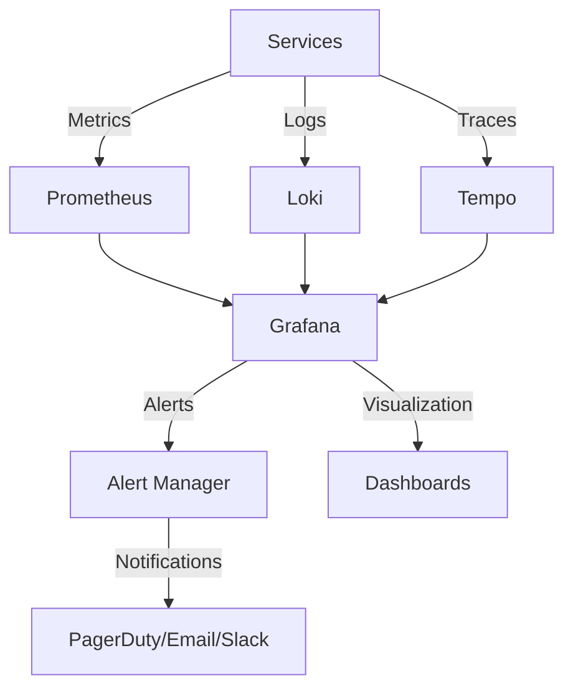

# Monitoring Strategy

## Table of Contents
- [Overview](#overview)
- [Monitoring Objectives](#monitoring-objectives)
- [Monitoring Architecture](#monitoring-architecture)
- [Metrics Collection](#metrics-collection)
- [Logs and Traces](#logs-and-traces)
- [Alerting Strategy](#alerting-strategy)
- [Dashboards](#dashboards)
- [Performance Monitoring](#performance-monitoring)
- [User Experience Monitoring](#user-experience-monitoring)
- [Synthetic Monitoring](#synthetic-monitoring)
- [Incident Management](#incident-management)
- [Capacity Planning](#capacity-planning)
- [Related Documents](#related-documents)

## Overview

This document outlines the monitoring strategy for the Global Remit platform, ensuring high availability, performance, and reliability. The strategy follows the Four Golden Signals: latency, traffic, errors, and saturation.

## Monitoring Objectives

### Key Objectives
1. **Availability**: Ensure 99.99% uptime for critical services
2. **Performance**: Maintain sub-second response times for 95% of requests
3. **Reliability**: Minimize mean time to detect (MTTD) and mean time to resolve (MTTR) incidents
4. **User Experience**: Monitor and optimize end-user experience
5. **Cost Efficiency**: Optimize resource utilization and costs

### Service Level Objectives (SLOs)
| Service | Availability | Latency (p95) | Error Rate |
|---------|--------------|----------------|------------|
| API Gateway | 99.99% | 500ms | < 0.1% |
| Transaction Service | 99.95% | 1s | < 0.1% |
| User Service | 99.9% | 300ms | < 0.5% |
| Database | 99.99% | 100ms | < 0.01% |
| Payment Gateway | 99.9% | 2s | < 0.5% |

## Monitoring Architecture

### High-Level Architecture


### Tooling Stack
- **Metrics**: Prometheus, Node Exporter, kube-state-metrics
- **Logs**: Loki with Promtail
- **Traces**: OpenTelemetry with Tempo
- **Visualization**: Grafana
- **Alerting**: Alert Manager
- **Synthetic Monitoring**: Grafana Synthetic Monitoring
- **Real User Monitoring**: OpenTelemetry Browser Agent

## Metrics Collection

### Infrastructure Metrics
- **CPU**: Usage, throttling, load averages
- **Memory**: Usage, swap, page faults
- **Disk**: Usage, IOPS, latency
- **Network**: Bandwidth, errors, TCP connections

### Application Metrics
- **Request Rate**: RPS by endpoint
- **Latency**: Response times (p50, p90, p99)
- **Error Rates**: 4xx, 5xx, business logic errors
- **Saturation**: Queue lengths, thread pools

### Business Metrics
- **Transactions**: Volume, value, success rate
- **Users**: Active, new, churn
- **Revenue**: Processed amounts, fees
- **Conversion**: Signup to transaction flow

## Logs and Traces

### Log Collection
- Structured JSON logging
- Correlation IDs for request tracing
- Log levels: DEBUG, INFO, WARN, ERROR, FATAL
- Log retention: 30 days hot, 1 year cold

### Distributed Tracing
- Trace all requests across services
- Capture timing and metadata
- Sample rate: 10% in production, 100% in staging
- Include business context in spans

## Alerting Strategy

### Alert Levels
| Level | Response Time | Notification Channel |
|-------|---------------|----------------------|
| P0 | Immediate | PagerDuty (24/7) |
| P1 | <15 minutes | PagerDuty |
| P2 | <1 hour | Email + Slack |
| P3 | Next business day | Email |

### Alert Examples
```yaml
alert: HighErrorRate
expr: rate(http_requests_total{status=~"5.."}[5m]) / rate(http_requests_total[5m]) > 0.01
for: 5m
labels:
  severity: critical
  team: platform
annotations:
  summary: High error rate on {{ $labels.instance }}
  description: "Error rate is {{ $value }} for {{ $labels.instance }}"
  runbook: https://runbooks.globalremit.com/high-error-rate
```

## Dashboards

### Standard Dashboard Layout
1. **Service Health**: Uptime, error rates, latency
2. **Resource Usage**: CPU, memory, disk, network
3. **Business Metrics**: Transactions, users, revenue
4. **Dependencies**: Status of external services
5. **Alerts**: Active and historical alerts

### Key Dashboards
1. **Service Overview**: High-level health of each service
2. **API Performance**: Endpoint performance and errors
3. **Database**: Query performance, connections, replication lag
4. **Business Metrics**: Transaction volume, success rates
5. **Infrastructure**: Cluster health and resource usage

## Performance Monitoring

### Key Performance Indicators
- **API Response Times**: p50, p90, p99, p999
- **Database Query Performance**: Slow queries, connection pools
- **Cache Hit Ratios**: Redis, CDN, and other caches
- **Queue Depths**: Message queue lengths and processing times

### Performance Budgets
| Metric | Warning | Critical |
|--------|---------|----------|
| Page Load Time | >2s | >4s |
| API Response (p95) | >1s | >3s |
| TTFB | >500ms | >1s |
| Bundle Size | >200KB | >500KB |

## User Experience Monitoring

### Real User Monitoring (RUM)
- Page load times
- First Contentful Paint (FCP)
- Largest Contentful Paint (LCP)
- First Input Delay (FID)
- Cumulative Layout Shift (CLS)

### Session Replay
- Record user sessions for error analysis
- Sample rate: 1% of sessions
- Mask sensitive data

## Synthetic Monitoring

### Synthetic Checks
- **Availability Checks**: HTTP, HTTPS, TCP, ICMP
- **Transaction Flows**: Critical user journeys
- **API Endpoints**: Health checks and validation
- **Browser Checks**: Full user flows

### Check Frequency
| Check Type | Frequency | Locations |
|------------|-----------|-----------|
| Critical Path | 1 min | 3+ regions |
| API Health | 1 min | 3+ regions |
| Full Flow | 5 min | Primary region |
| Performance | 15 min | 3+ regions |

## Incident Management

### Incident Response Process
1. **Detection**: Automated alerts or manual report
2. **Triage**: Determine severity and impact
3. **Containment**: Mitigate impact
4. **Resolution**: Fix the root cause
5. **Recovery**: Restore service
6. **Review**: Post-mortem and action items

### Post-Mortem Process
- Timeline of events
- Root cause analysis
- Impact assessment
- Action items with owners
- Follow-up on improvements

## Capacity Planning

### Resource Forecasting
- **Trend Analysis**: 30/60/90 day trends
- **Seasonal Patterns**: Daily, weekly, monthly patterns
- **Growth Projections**: Based on business forecasts
- **Scaling Triggers**: Auto-scaling rules and thresholds

### Capacity Reviews
- Monthly capacity reviews
- Pre-holiday capacity planning
- Post-incident capacity analysis
- Annual capacity planning

## Related Documents
- [Architecture Overview](010-ARCHITECTURE-OVERVIEW.md)
- [System Components](011-SYSTEM-COMPONENTS.md)
- [Scalability](015-SCALABILITY.md)
- [Security Architecture](016-SECURITY-ARCHITECTURE.md)
- [Error Handling Strategy](017-ERROR-HANDLING-STRATEGY.md)
- [Logging Strategy](018-LOGGING-STRATEGY.md)

---
*Last updated: June 20, 2025*
