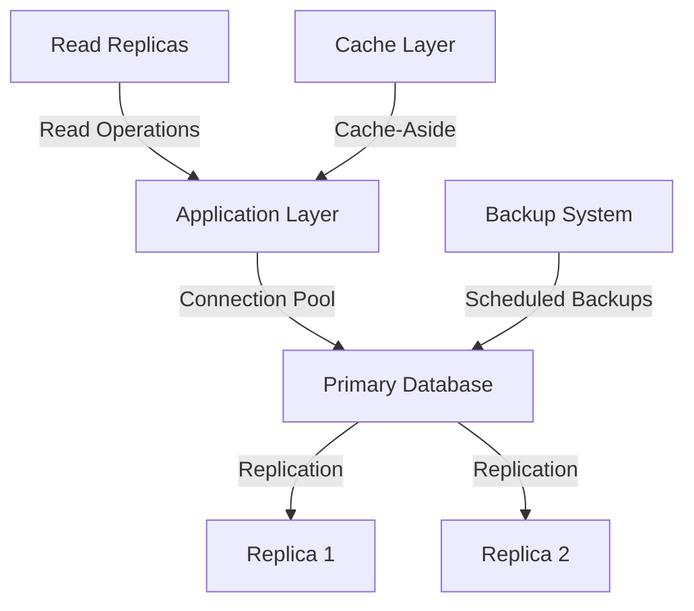
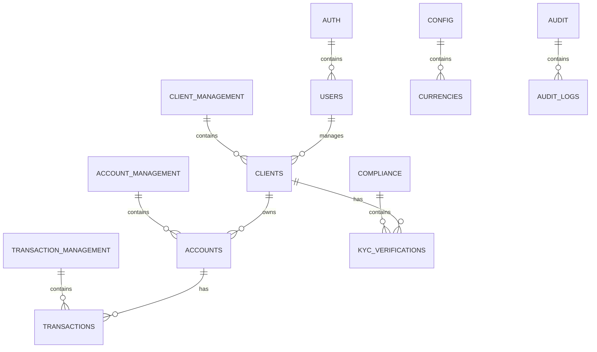

# Database Overview

## Table of Contents
- [Introduction](#introduction)
- [Database Architecture](#database-architecture)
- [Database Technologies](#database-technologies)
- [Database Schema](#database-schema)
- [Data Access Layer](#data-access-layer)
- [Replication and High Availability](#replication-and-high-availability)
- [Backup and Recovery](#backup-and-recovery)
- [Performance Considerations](#performance-considerations)
- [Security](#security)
- [Monitoring and Maintenance](#monitoring-and-maintenance)
- [Migrations](#migrations)
- [Related Documents](#related-documents)

## Introduction

This document provides an overview of the database architecture and design principles for the Global Remit platform. The database is a critical component that stores all transactional and reference data, ensuring data integrity, performance, and reliability.

## Database Architecture

### High-Level Architecture

### Database Tiers
1. **Primary Database**
   - Handles all write operations
   - Synchronous replication to standby
   - Automatic failover capability

2. **Read Replicas**
   - Asynchronous replication from primary
   - Handle read operations
   - Geographically distributed

3. **Analytics Replica**
   - Delayed replication (1 hour)
   - Used for reporting and analytics
   - Heavy read operations

## Database Technologies

### Primary Database: PostgreSQL 15
- **Version**: 15.3+
- **Extensions**: 
  - `pg_stat_statements` for query monitoring
  - `pg_partman` for table partitioning
  - `pgcrypto` for encryption
  - `uuid-ossp` for UUID generation
  - `timescaledb` for time-series data

### Caching: Redis 7.0+
- Session storage
- Rate limiting
- Distributed locking
- Caching layer for hot data

### Search: Elasticsearch 8.0+
- Full-text search
- Advanced querying
- Analytics

## Database Schema

### Schema Organization

The database is organized into logical schemas that align with the application's domain model:

### Core Schemas:
- `auth`: Authentication and authorization (users, roles, permissions)
- `client_management`: Client data and relationships
- `account_management`: Financial accounts and balances
- `transaction_management`: Transaction processing and history
- `compliance`: KYC, AML, and regulatory requirements
- `config`: System configuration and reference data
- `audit`: Audit trails and system events

### Naming Conventions
- **Tables**: Plural, snake_case (`users`, `bank_accounts`)
- **Columns**: Singular, snake_case (`first_name`, `created_at`)
- **Primary Keys**: `id` (UUID v7)
- **Foreign Keys**: `table_name_singular_id` (`user_id`, `account_id`)
- **Timestamps**: `created_at`, `updated_at`, `deleted_at`
- **Boolean**: Prefix with `is_`, `has_`, or `can_` (`is_active`, `has_verified_email`)
- **Constraints**: `table_column_constraint` (e.g., `users_email_key`)
- **Indexes**: `idx_table_column_purpose` (e.g., `idx_users_email_lower`)

## Data Access Layer

### ORM: TypeORM
- TypeScript support
- Connection pooling
- Transaction management
- Query builder
- Migration support

### Connection Management
- Connection pooling with `pgbouncer`
- Max connections: 100 per application instance
- Statement timeout: 30 seconds
- Idle timeout: 10 minutes

### Query Patterns
- Use prepared statements to prevent SQL injection
- Implement pagination for large result sets
- Use transactions for multi-statement operations
- Implement retry logic for transient failures

## Replication and High Availability

### Replication Strategy
- **Synchronous Replication**: For primary and standby
- **Asynchronous Replication**: For read replicas
- **Logical Replication**: For cross-database sync

### Failover Process
1. Detect primary failure (30s timeout)
2. Promote standby to primary
3. Reconfigure replicas to follow new primary
4. Update DNS/connection strings
5. Notify operations team

## Backup and Recovery

### Backup Strategy
- **Full Backups**: Weekly (kept for 4 weeks)
- **Incremental Backups**: Hourly (kept for 7 days)
- **WAL Archiving**: Continuous
- **Offsite Backup**: Daily to S3 (encrypted)

### Recovery Objectives
- **RPO (Recovery Point Objective)**: 5 minutes
- **RTO (Recovery Time Objective)**: 15 minutes
- **Test Restores**: Weekly

## Performance Considerations

### Indexing Strategy
- B-tree for most common queries
- GIN for JSONB columns
- Partial indexes for filtered queries
- Monitor index usage and bloat

### Partitioning
- **Time-based**: For time-series data (transactions, logs)
- **List-based**: For discrete values (country, status)
- **Range-based**: For numeric ranges (amounts, dates)

### Query Optimization
- Use `EXPLAIN ANALYZE` for slow queries
- Set appropriate `work_mem` per query
- Monitor long-running transactions
- Use materialized views for complex aggregations

## Security

### Data Encryption
- **At Rest**: AES-256
- **In Transit**: TLS 1.3
- **Application-Level**: Field-level encryption for PII

### Access Control
- Role-based access control (RBAC)
- Principle of least privilege
- Regular access reviews
- Audit logging of all privileged operations

### Data Masking
- Implement column-level security
- Dynamic data masking for sensitive fields
- Redaction of sensitive data in logs

## Monitoring and Maintenance

### Key Metrics
- Query performance
- Replication lag
- Connection pool usage
- Deadlocks and long-running transactions
- Disk space usage

### Maintenance Tasks
- **VACUUM**: Auto-vacuum with aggressive settings
- **ANALYZE**: Auto-analyze with statistics collection
- **REINDEX**: Monthly for heavily updated tables
- **Statistics**: Extended statistics for query planning

## Migrations

### Migration Strategy
- Version-controlled migrations
- Rollback capability for every migration
- Zero-downtime deployments
- Blue-green schema changes

### Migration Tools
- TypeORM migrations
- Flyway for Java services
- Custom scripts for complex changes

## Related Documents
- [Schema Design](031-SCHEMA-DESIGN-OVERVIEW.md): Detailed database schema documentation
- [Database Security](039-DATABASE-SECURITY.md): Security policies and configurations
- [Performance Tuning](038-PERFORMANCE-TUNING.md): Optimization strategies
- [Migrations Guide](035-MIGRATIONS-GUIDE.md): Database versioning and changes

---
*Last updated: June 20, 2025*
