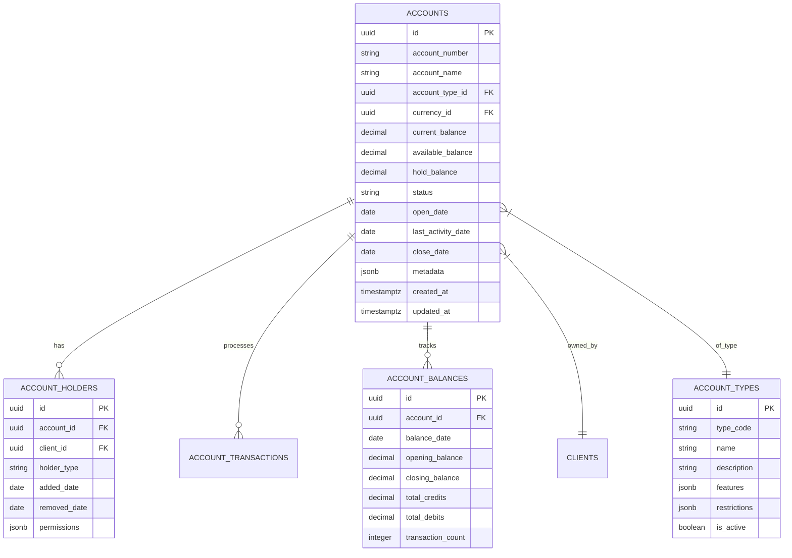

# Core Schema: Accounts

## Overview
The `core.accounts` schema manages all financial accounts in the Global Remit system. This includes account creation, management, and account-specific configurations.

## Schema Diagram



## Tables

### accounts
Stores core account information.

```sql
CREATE TABLE core.accounts (
    -- Core Identity
    id UUID PRIMARY KEY DEFAULT gen_random_uuid(),
    account_number VARCHAR(20) UNIQUE NOT NULL,
    account_name VARCHAR(255) NOT NULL,
    
    -- Account Type
    account_type_id UUID NOT NULL REFERENCES core.account_types(id),
    
    -- Currency
    currency_id UUID NOT NULL REFERENCES core.currencies(id),
    
    -- Balances
    current_balance DECIMAL(19, 4) NOT NULL DEFAULT 0,
    available_balance DECIMAL(19, 4) NOT NULL DEFAULT 0,
    hold_balance DECIMAL(19, 4) NOT NULL DEFAULT 0,
    
    -- Status
    status VARCHAR(20) NOT NULL DEFAULT 'ACTIVE'
        CHECK (status IN ('PENDING', 'ACTIVE', 'DORMANT', 'RESTRICTED', 'CLOSED')),
    
    -- Dates
    open_date DATE NOT NULL DEFAULT CURRENT_DATE,
    last_activity_date DATE,
    close_date DATE,
    
    -- Metadata
    metadata JSONB,
    
    -- System
    created_at TIMESTAMPTZ NOT NULL DEFAULT NOW(),
    updated_at TIMESTAMPTZ NOT NULL DEFAULT NOW(),
    created_by UUID NOT NULL REFERENCES auth.users(id),
    updated_by UUID REFERENCES auth.users(id),
    version INTEGER NOT NULL DEFAULT 1,
    
    -- Constraints
    CONSTRAINT chk_balance_non_negative CHECK (current_balance >= 0),
    CONSTRAINT chk_available_balance CHECK (available_balance <= current_balance),
    CONSTRAINT chk_hold_balance CHECK (hold_balance <= current_balance),
    CONSTRAINT chk_dates CHECK (
        (close_date IS NULL) OR 
        (close_date IS NOT NULL AND close_date >= open_date)
    )
);

-- Indexes
CREATE INDEX idx_accounts_number ON core.accounts(account_number);
CREATE INDEX idx_accounts_type ON core.accounts(account_type_id);
CREATE INDEX idx_accounts_currency ON core.accounts(currency_id);
CREATE INDEX idx_accounts_status ON core.accounts(status);
CREATE INDEX idx_accounts_balance ON core.accounts(current_balance);
CREATE INDEX idx_accounts_open_date ON core.accounts(open_date);
```

### account_types
Defines different types of accounts.

```sql
CREATE TABLE core.account_types (
    id UUID PRIMARY KEY DEFAULT gen_random_uuid(),
    type_code VARCHAR(20) UNIQUE NOT NULL,
    name VARCHAR(100) NOT NULL,
    description TEXT,
    
    -- Account Features
    features JSONB NOT NULL DEFAULT '{}'::jsonb,
    restrictions JSONB NOT NULL DEFAULT '{}'::jsonb,
    
    -- Status
    is_active BOOLEAN NOT NULL DEFAULT true,
    
    -- System
    created_at TIMESTAMPTZ NOT NULL DEFAULT NOW(),
    updated_at TIMESTAMPTZ NOT NULL DEFAULT NOW(),
    created_by UUID NOT NULL REFERENCES auth.users(id),
    updated_by UUID REFERENCES auth.users(id),
    version INTEGER NOT NULL DEFAULT 1
);

-- Insert common account types
INSERT INTO core.account_types (
    id, type_code, name, description, features, restrictions, created_by
) VALUES 
    ('00000000-0000-0000-0001-000000000001', 'SAVINGS', 'Savings Account', 
     'Standard savings account with interest',
     '{"interest_rate": 0.5, "monthly_fee": 0, "withdrawal_limit": 6, "min_balance": 100}',
     '{"min_opening_balance": 100, "min_age": 18}',
     '00000000-0000-0000-0000-000000000001'),
     
    ('00000000-0000-0000-0001-000000000002', 'CHECKING', 'Checking Account',
     'Everyday transaction account',
     '{"interest_rate": 0.1, "monthly_fee": 10, "withdrawal_limit": null, "check_writing": true}',
     '{"min_opening_balance": 50, "min_age": 18}',
     '00000000-0000-0000-0000-000000000001');
```

### account_holders
Tracks account ownership and permissions.

```sql
CREATE TABLE core.account_holders (
    id UUID PRIMARY KEY DEFAULT gen_random_uuid(),
    account_id UUID NOT NULL REFERENCES core.accounts(id) ON DELETE CASCADE,
    client_id UUID NOT NULL REFERENCES core.clients(id) ON DELETE CASCADE,
    
    -- Holder Information
    holder_type VARCHAR(20) NOT NULL DEFAULT 'PRIMARY' 
        CHECK (holder_type IN ('PRIMARY', 'JOINT', 'AUTHORIZED', 'BENEFICIARY', 'POWER_OF_ATTORNEY')),
    
    -- Dates
    added_date DATE NOT NULL DEFAULT CURRENT_DATE,
    removed_date DATE,
    
    -- Permissions
    permissions JSONB NOT NULL DEFAULT '{"view": true, "transact": true, "manage": false}'::jsonb,
    
    -- System
    created_at TIMESTAMPTZ NOT NULL DEFAULT NOW(),
    updated_at TIMESTAMPTZ NOT NULL DEFAULT NOW(),
    created_by UUID NOT NULL REFERENCES auth.users(id),
    updated_by UUID REFERENCES auth.users(id),
    version INTEGER NOT NULL DEFAULT 1,
    
    -- Constraints
    CONSTRAINT chk_removal_date CHECK (
        (removed_date IS NULL) OR 
        (removed_date IS NOT NULL AND removed_date >= added_date)
    ),
    CONSTRAINT uq_account_holder UNIQUE (account_id, client_id, holder_type)
);

-- Indexes
CREATE INDEX idx_account_holders_account ON core.account_holders(account_id);
CREATE INDEX idx_account_holders_client ON core.account_holders(client_id);
CREATE INDEX idx_account_holders_type ON core.account_holders(holder_type);
```

### account_balances
Tracks daily account balances.

```sql
CREATE TABLE core.account_balances (
    id UUID PRIMARY KEY DEFAULT gen_random_uuid(),
    account_id UUID NOT NULL REFERENCES core.accounts(id) ON DELETE CASCADE,
    
    -- Balance Information
    balance_date DATE NOT NULL,
    opening_balance DECIMAL(19, 4) NOT NULL,
    closing_balance DECIMAL(19, 4) NOT NULL,
    total_credits DECIMAL(19, 4) NOT NULL DEFAULT 0,
    total_debits DECIMAL(19, 4) NOT NULL DEFAULT 0,
    transaction_count INTEGER NOT NULL DEFAULT 0,
    
    -- System
    created_at TIMESTAMPTZ NOT NULL DEFAULT NOW(),
    updated_at TIMESTAMPTZ NOT NULL DEFAULT NOW(),
    created_by UUID NOT NULL REFERENCES auth.users(id),
    updated_by UUID REFERENCES auth.users(id),
    version INTEGER NOT NULL DEFAULT 1,
    
    -- Constraints
    CONSTRAINT chk_positive_balances CHECK (
        opening_balance >= 0 AND 
        closing_balance >= 0 AND
        total_credits >= 0 AND
        total_debits >= 0
    ),
    CONSTRAINT uq_daily_balance UNIQUE (account_id, balance_date)
);

-- Indexes
CREATE INDEX idx_account_balances_account ON core.account_balances(account_id);
CREATE INDEX idx_account_balances_date ON core.account_balances(balance_date);
```

## Functions

### generate_account_number
Generates a unique account number.

```sql
CREATE OR REPLACE FUNCTION core.generate_account_number(
    p_branch_code VARCHAR(10),
    p_account_type VARCHAR(10)
) RETURNS VARCHAR(20) AS $$
DECLARE
    v_account_number VARCHAR(20);
    v_check_digit CHAR(1);
    v_sequence INTEGER;
BEGIN
    -- Get the next sequence number for this branch and account type
    SELECT COALESCE(MAX(SUBSTRING(account_number, 10, 8)::INTEGER), 0) + 1
    INTO v_sequence
    FROM core.accounts
    WHERE account_number LIKE p_branch_code || p_account_type || '%';
    
    -- Format: Branch (3) + Type (2) + Sequence (8) + Check Digit (1)
    v_account_number := p_branch_code || 
                        p_account_type || 
                        LPAD(v_sequence::TEXT, 8, '0');
    
    -- Calculate check digit using Luhn algorithm
    v_check_digit := core.calculate_luhn_check_digit(v_account_number);
    
    -- Return full account number with check digit
    RETURN v_account_number || v_check_digit;
END;
$$ LANGUAGE plpgsql;
```

### create_account
Creates a new account.

```sql
CREATE OR REPLACE FUNCTION core.create_account(
    p_client_id UUID,
    p_account_type_id UUID,
    p_currency_id UUID,
    p_initial_deposit DECIMAL(19, 4) DEFAULT 0,
    p_account_name VARCHAR(255) DEFAULT NULL,
    p_created_by UUID
) RETURNS UUID AS $$
DECLARE
    v_account_id UUID;
    v_account_number VARCHAR(20);
    v_client_name VARCHAR(255);
    v_account_type_code VARCHAR(20);
    v_branch_code VARCHAR(10) := '001'; -- Default branch code
BEGIN
    -- Validate initial deposit
    IF p_initial_deposit < 0 THEN
        RAISE EXCEPTION 'Initial deposit cannot be negative';
    END IF;
    
    -- Get client name for account name if not provided
    IF p_account_name IS NULL THEN
        SELECT CONCAT_WS(' ', first_name, last_name) 
        INTO v_client_name
        FROM core.clients 
        WHERE id = p_client_id;
        
        IF NOT FOUND THEN
            RAISE EXCEPTION 'Client not found';
        END IF;
        
        -- Get account type code
        SELECT type_code INTO v_account_type_code
        FROM core.account_types
        WHERE id = p_account_type_id;
        
        IF NOT FOUND THEN
            RAISE EXCEPTION 'Account type not found';
        END IF;
        
        p_account_name := v_client_name || ' ' || v_account_type_code || ' Account';
    END IF;
    
    -- Generate account number
    v_account_number := core.generate_account_number(v_branch_code, v_account_type_code);
    
    -- Create the account
    INSERT INTO core.accounts (
        account_number,
        account_name,
        account_type_id,
        currency_id,
        current_balance,
        available_balance,
        status,
        open_date,
        last_activity_date,
        created_by,
        updated_by
    ) VALUES (
        v_account_number,
        p_account_name,
        p_account_type_id,
        p_currency_id,
        p_initial_deposit,
        p_initial_deposit,
        'ACTIVE',
        CURRENT_DATE,
        CURRENT_DATE,
        p_created_by,
        p_created_by
    ) RETURNING id INTO v_account_id;
    
    -- Add account holder
    INSERT INTO core.account_holders (
        account_id,
        client_id,
        holder_type,
        permissions,
        created_by,
        updated_by
    ) VALUES (
        v_account_id,
        p_client_id,
        'PRIMARY',
        '{"view": true, "transact": true, "manage": true}'::jsonb,
        p_created_by,
        p_created_by
    );
    
    -- Record initial balance
    IF p_initial_deposit > 0 THEN
        INSERT INTO core.account_balances (
            account_id,
            balance_date,
            opening_balance,
            closing_balance,
            total_credits,
            transaction_count,
            created_by,
            updated_by
        ) VALUES (
            v_account_id,
            CURRENT_DATE,
            0,
            p_initial_deposit,
            p_initial_deposit,
            1,
            p_created_by,
            p_created_by
        );
    END IF;
    
    -- Log the account creation
    PERFORM audit.log_security_event(
        'account:create',
        v_account_id,
        p_created_by,
        jsonb_build_object(
            'account_number', v_account_number,
            'account_type_id', p_account_type_id,
            'initial_deposit', p_initial_deposit
        ),
        NULL,
        'New account created',
        'SUCCESS'
    );
    
    RETURN v_account_id;
EXCEPTION
    WHEN OTHERS THEN
        -- Log the error
        PERFORM audit.log_security_event(
            'account:create:error',
            NULL,
            p_created_by,
            jsonb_build_object(
                'error', SQLERRM,
                'client_id', p_client_id,
                'account_type_id', p_account_type_id
            ),
            NULL,
            'Failed to create account: ' || SQLERRM,
            'ERROR'
        );
        
        RAISE;
END;
$$ LANGUAGE plpgsql;
```

## Security Considerations

### Access Control
- Account access is controlled through the `account_holders` table
- Fine-grained permissions control what actions can be performed on each account
- All access is logged for audit purposes

### Data Protection
- Sensitive account information is encrypted at rest
- Account numbers are generated using a secure algorithm
- Balance updates are performed within transactions to ensure consistency

### Compliance
- Account opening follows KYC/AML procedures
- Transaction monitoring is in place for suspicious activities
- Account statements are retained according to regulatory requirements

## API Integration

The account management system provides the following endpoints:

- `POST /api/v1/accounts` - Create a new account
- `GET /api/v1/accounts/{id}` - Get account details
- `GET /api/v1/accounts` - List accounts with filtering
- `POST /api/v1/accounts/{id}/holders` - Add account holder
- `GET /api/v1/accounts/{id}/balance` - Get current balance
- `GET /api/v1/accounts/{id}/transactions` - List account transactions
- `POST /api/v1/accounts/{id}/status` - Update account status
