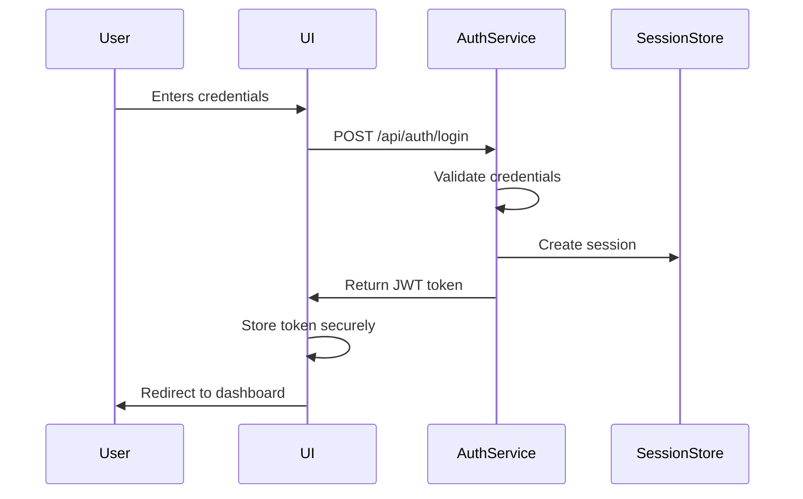

# Authentication & Authorization Overview

## Table of Contents
1. [Introduction](#introduction)
2. [Authentication Flow](#authentication-flow)
3. [Authorization Model](#authorization-model)
4. [Security Considerations](#security-considerations)
5. [Session Management](#session-management)
6. [Multi-Factor Authentication](#multi-factor-authentication)
7. [Password Policies](#password-policies)
8. [Token Management](#token-management)
9. [Related Documents](#related-documents)
10. [Version History](#version-history)

## Introduction

This document provides an overview of the authentication and authorization strategy for the Global Remit application. The system implements a robust, secure, and scalable approach to user authentication and access control, following industry best practices and compliance requirements.

### Key Components

| Component | Description |
|-----------|-------------|
| **Authentication Service** | Handles user identity verification |
| **Authorization Service** | Manages permissions and access control |
| **Session Manager** | Handles user sessions and tokens |
| **Audit Logger** | Tracks authentication and authorization events |
| **Rate Limiter** | Protects against brute force attacks |

## Authentication Flow

### User Login Process



### Token Generation

1. **JWT Structure**
   ```typescript
   interface JwtPayload {
     sub: string;       // User ID
     email: string;     // User email
     role: string;      // User role
     iat: number;       // Issued at
     exp: number;       // Expiration time
     jti: string;       // JWT ID
   }
   ```

2. **Token Types**
   | Token Type | Purpose | Expiration |
   |------------|---------|------------|
   | Access Token | API access | 15 minutes |
   | Refresh Token | Get new access token | 7 days |
   | ID Token | User information | 1 hour |

## Authorization Model

### Role-Based Access Control (RBAC)

| Role | Description | Example Permissions |
|------|-------------|----------------------|
| **Teller** | Standard teller | Process transactions, view client info |
| **Senior Teller** | Experienced teller | Approve transactions, override limits |
| **Manager** | Branch manager | Manage users, override transactions |
| **Admin** | System administrator | System configuration, user management |
| **Auditor** | Compliance officer | View audit logs, generate reports |

### Permission Structure

```typescript
interface Permission {
  resource: string;      // e.g., 'transaction', 'client', 'account'
  action: string;       // e.g., 'create', 'read', 'update', 'delete'
  attributes?: string;  // e.g., 'own', 'branch', 'all'
  condition?: Function; // Optional condition function
}
```

## Security Considerations

### Password Security
- Minimum 12 characters
- Require uppercase, lowercase, numbers, and special characters
- Password history (last 5 passwords)
- Account lockout after 5 failed attempts
- Secure password reset flow

### Session Security
- Secure, HttpOnly, SameSite cookies
- CSRF protection
- Session timeout after 30 minutes of inactivity
- Maximum session duration of 8 hours
- Automatic session termination on password change

### Token Security
- Short-lived access tokens
- Secure token storage
- Token rotation
- Token revocation on logout
- IP-based token validation

## Session Management

### Session Storage
- Redis for distributed session storage
- Encrypted session data
- Session expiration and cleanup
- Concurrent session control

### Session Events
- Login success/failure
- Logout
- Session timeout
- Concurrent login detection
- Suspicious activity detection

## Multi-Factor Authentication

### MFA Methods
1. **SMS Verification**
   - One-time passcode via SMS
   - 6-digit code, 5-minute expiration

2. **Authenticator App**
   - TOTP (Time-based One-Time Password)
   - 30-second window
   - 6-digit code

3. **Biometric**
   - Fingerprint/Face ID
   - Device-based authentication

### MFA Requirements
- Required for all administrative actions
- Optional for standard users (configurable)
- Fallback methods available
- Recovery codes for backup

## Password Policies

### Complexity Requirements
- Minimum length: 12 characters
- At least 1 uppercase letter
- At least 1 lowercase letter
- At least 1 number
- At least 1 special character
- No common passwords
- No username in password

### Password Expiration
- 90 days for standard users
- 60 days for privileged accounts
- 30-day warning period
- Password history (last 5 passwords)

## Token Management

### Access Token
- JWT format
- 15-minute expiration
- Contains user ID, roles, and permissions
- Signed with RSA-256

### Refresh Token
- Opaque token
- 7-day expiration
- One-time use
- Rotated on each use
- Stored securely in HTTP-only cookie

### Token Revocation
- Logout endpoint
- Revoke all tokens on password change
- Admin-initiated revocation
- Automatic revocation after suspicious activity

## Related Documents
- [Next.js Auth Integration](./061-NEXTJS-AUTH-INTEGRATION.md)
- [JWT Strategy](./062-JWT-STRATEGY.md)
- [Role-Based Access Control](./064-ROLE-BASED-ACCESS-CONTROL.md)
- [Session Management](./063-SESSION-MANAGEMENT.md)
- [Multi-Factor Authentication](./067-MULTI-FACTOR-AUTH.md)
- [Password Policies](./066-PASSWORD-POLICIES.md)

## Version History
| Date | Version | Description |
|------|---------|-------------|
| 2025-06-20 | 1.0 | Initial version |
