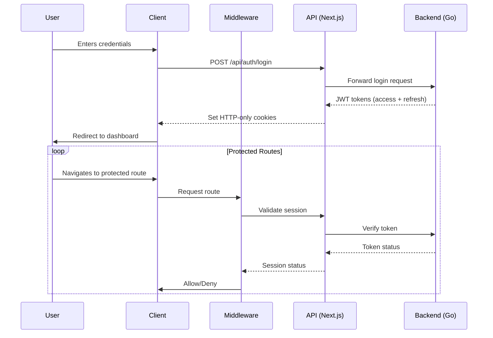

# Next.js Auth Integration

## Table of Contents
1. [Overview](#overview)
2. [Authentication Flow](#authentication-flow)
3. [Setup and Configuration](#setup-and-configuration)
4. [Protected Routes](#protected-routes)
5. [API Route Protection](#api-route-protection)
6. [Middleware](#middleware)
7. [Server Components](#server-components)
8. [Client Components](#client-components)
9. [Error Handling](#error-handling)
10. [Testing](#testing)
11. [Related Documents](#related-documents)
12. [Version History](#version-history)

## Overview

This document outlines the implementation of authentication in the Next.js frontend application, specifically designed to work with our Go backend authentication services. It covers the integration of JWT-based authentication with proper session management and protected routes.

### Key Features

- Server-side session validation
- Protected API routes
- Route protection using middleware
- Seamless integration with Next.js 14 App Router
- Support for both Server and Client Components
- Token refresh mechanism
- Role-based access control

## Authentication Flow

### Login Flow



## Setup and Configuration

### Environment Variables

Create a `.env.local` file with:

```env
NEXT_PUBLIC_API_URL=https://api.yourdomain.com
NEXT_PUBLIC_APP_URL=https://app.yourdomain.com
NEXTAUTH_SECRET=your-secret-here
NEXTAUTH_URL=http://localhost:3000
```

### Auth Configuration

Create `lib/auth.ts`:

```typescript
import { NextAuthOptions } from 'next-auth';
import CredentialsProvider from 'next-auth/providers/credentials';

export const authOptions: NextAuthOptions = {
  providers: [
    CredentialsProvider({
      name: 'Credentials',
      credentials: {
        email: { label: "Email", type: "email" },
        password: { label: "Password", type: "password" }
      },
      async authorize(credentials) {
        try {
          const res = await fetch(`${process.env.NEXT_PUBLIC_API_URL}/auth/login`, {
            method: 'POST',
            body: JSON.stringify(credentials),
            headers: { 'Content-Type': 'application/json' }
          });
          
          const user = await res.json();
          
          if (res.ok && user) {
            return user;
          }
          return null;
        } catch (error) {
          console.error('Auth error:', error);
          return null;
        }
      }
    })
  ],
  session: {
    strategy: 'jwt',
    maxAge: 30 * 60, // 30 minutes
  },
  callbacks: {
    async jwt({ token, user }) {
      if (user) {
        token.accessToken = user.accessToken;
        token.role = user.role;
      }
      return token;
    },
    async session({ session, token }) {
      if (token) {
        session.accessToken = token.accessToken;
        session.user.role = token.role;
      }
      return session;
    },
  },
  pages: {
    signIn: '/auth/login',
    error: '/auth/error',
  },
  debug: process.env.NODE_ENV === 'development',
};
```

### Auth Provider

Create `app/providers.tsx`:

```tsx
'use client';

import { SessionProvider } from 'next-auth/react';

export function Providers({ children }: { children: React.ReactNode }) {
  return (
    <SessionProvider>
      {children}
    </SessionProvider>
  );
}
```

Update `app/layout.tsx`:

```tsx
import { Providers } from './providers';

export default function RootLayout({
  children,
}: {
  children: React.ReactNode;
}) {
  return (
    <html lang="en">
      <body>
        <Providers>
          {children}
        </Providers>
      </body>
    </html>
  );
}
```

## Protected Routes

### Route Protection with Middleware

Create `middleware.ts`:

```typescript
import { withAuth } from 'next-auth/middleware';
import { NextResponse } from 'next/server';

export default withAuth(
  function middleware(req) {
    // Add custom middleware logic here
    return NextResponse.next();
  },
  {
    callbacks: {
      authorized: ({ token }) => {
        return !!token;
      },
    },
    pages: {
      signIn: '/auth/login',
    },
  }
);

export const config = {
  matcher: [
    '/dashboard/:path*',
    '/transactions/:path*',
    '/clients/:path*',
    '/reports/:path*',
  ],
};
```

### Role-Based Route Protection

Create `app/dashboard/layout.tsx`:

```tsx
import { getServerSession } from 'next-auth';
import { redirect } from 'next/navigation';
import { authOptions } from '@/lib/auth';

export default async function DashboardLayout({
  children,
}: {
  children: React.ReactNode;
}) {
  const session = await getServerSession(authOptions);
  
  if (!session) {
    redirect('/auth/login');
  }
  
  return (
    <div className="flex h-screen">
      <Sidebar userRole={session.user.role} />
      <main className="flex-1 overflow-y-auto p-6">
        {children}
      </main>
    </div>
  );
}
```

## API Route Protection

### Protected API Routes

Create `app/api/protected/route.ts`:

```typescript
import { getServerSession } from 'next-auth';
import { NextResponse } from 'next/server';
import { authOptions } from '@/lib/auth';

export async function GET() {
  const session = await getServerSession(authOptions);
  
  if (!session) {
    return NextResponse.json(
      { error: 'Unauthorized' },
      { status: 401 }
    );
  }
  
  // Role-based access control
  if (session.user.role !== 'admin') {
    return NextResponse.json(
      { error: 'Forbidden' },
      { status: 403 }
    );
  }
  
  return NextResponse.json({ data: 'Protected data' });
}
```

## Server Components

### User Session in Server Components

Create `app/dashboard/page.tsx`:

```tsx
import { getServerSession } from 'next-auth';
import { redirect } from 'next/navigation';
import { authOptions } from '@/lib/auth';

export default async function DashboardPage() {
  const session = await getServerSession(authOptions);
  
  if (!session) {
    redirect('/auth/login');
  }
  
  return (
    <div>
      <h1>Welcome, {session.user?.name}</h1>
      <UserProfile userId={session.user.id} />
    </div>
  );
}

async function UserProfile({ userId }: { userId: string }) {
  // Fetch user-specific data
  const userData = await fetchUserData(userId);
  
  return (
    <div>
      <p>Email: {userData.email}</p>
      <p>Role: {userData.role}</p>
    </div>
  );
}
```

## Client Components

### Using Session in Client Components

Create `components/UserMenu.tsx`:

```tsx
'use client';

import { signOut, useSession } from 'next-auth/react';
import { useRouter } from 'next/navigation';

export default function UserMenu() {
  const { data: session, status } = useSession();
  const router = useRouter();
  
  if (status === 'loading') {
    return <div>Loading...</div>;
  }
  
  if (!session) {
    return (
      <button 
        onClick={() => router.push('/auth/login')}
        className="px-4 py-2 rounded bg-blue-600 text-white"
      >
        Sign In
      </button>
    );
  }
  
  return (
    <div className="flex items-center space-x-4">
      <span>Hello, {session.user?.name}</span>
      <button 
        onClick={() => signOut({ callbackUrl: '/auth/login' })}
        className="px-4 py-2 rounded bg-gray-200 hover:bg-gray-300"
      >
        Sign Out
      </button>
    </div>
  );
}
```

## Error Handling

### Custom Error Pages

Create `app/auth/error/page.tsx`:

```tsx
'use client';

import { useEffect } from 'react';
import { useSearchParams } from 'next/navigation';

export default function AuthErrorPage() {
  const searchParams = useSearchParams();
  const error = searchParams.get('error');
  
  const errorMessages: Record<string, string> = {
    Signin: 'Please sign in to access this page.',
    OAuthSignin: 'Error in OAuth sign in.',
    OAuthCallback: 'Error in OAuth callback.',
    OAuthCreateAccount: 'Error creating OAuth account.',
    EmailCreateAccount: 'Error creating email account.',
    Callback: 'Error in callback.',
    OAuthAccountNotLinked: 'Email already in use with different provider.',
    EmailSignin: 'Error sending sign in email.',
    CredentialsSignin: 'Invalid credentials.',
    SessionRequired: 'Please sign in to access this page.',
    default: 'An error occurred.',
  };
  
  const errorMessage = error && (errorMessages[error] ?? errorMessages.default);
  
  return (
    <div className="min-h-screen flex items-center justify-center bg-gray-50">
      <div className="max-w-md w-full space-y-8 p-8 bg-white rounded-lg shadow">
        <div>
          <h2 className="mt-6 text-center text-3xl font-extrabold text-gray-900">
            Authentication Error
          </h2>
          <p className="mt-2 text-center text-sm text-gray-600">
            {errorMessage}
          </p>
        </div>
        <div className="mt-8 space-y-6">
          <div>
            <a
              href="/auth/login"
              className="group relative w-full flex justify-center py-2 px-4 border border-transparent text-sm font-medium rounded-md text-white bg-blue-600 hover:bg-blue-700 focus:outline-none focus:ring-2 focus:ring-offset-2 focus:ring-blue-500"
            >
              Return to Sign In
            </a>
          </div>
        </div>
      </div>
    </div>
  );
}
```

## Testing

### Authentication Tests

Create `__tests__/auth.test.tsx`:

```tsx
import { render, screen, fireEvent } from '@testing-library/react';
import { signIn } from 'next-auth/react';
import LoginForm from '@/components/LoginForm';
import { useRouter } from 'next/navigation';

// Mock next-auth/react
jest.mock('next-auth/react');
jest.mock('next/navigation', () => ({
  useRouter: jest.fn(),
}));

describe('LoginForm', () => {
  const mockPush = jest.fn();
  
  beforeEach(() => {
    (useRouter as jest.Mock).mockReturnValue({
      push: mockPush,
    });
  });
  
  afterEach(() => {
    jest.clearAllMocks();
  });
  
  it('allows users to log in successfully', async () => {
    (signIn as jest.Mock).mockResolvedValueOnce({ ok: true });
    
    render(<LoginForm />);
    
    fireEvent.change(screen.getByLabelText(/email/i), {
      target: { value: 'user@example.com' },
    });
    
    fireEvent.change(screen.getByLabelText(/password/i), {
      target: { value: 'password123' },
    });
    
    fireEvent.click(screen.getByRole('button', { name: /sign in/i }));
    
    expect(signIn).toHaveBeenCalledWith('credentials', {
      email: 'user@example.com',
      password: 'password123',
      redirect: false,
    });
    
    // Check for successful redirect
    expect(mockPush).toHaveBeenCalledWith('/dashboard');
  });
  
  it('shows error message on login failure', async () => {
    (signIn as jest.Mock).mockResolvedValueOnce({
      error: 'Invalid credentials',
    });
    
    render(<LoginForm />);
    
    fireEvent.change(screen.getByLabelText(/email/i), {
      target: { value: 'user@example.com' },
    });
    
    fireEvent.change(screen.getByLabelText(/password/i), {
      target: { value: 'wrongpassword' },
    });
    
    fireEvent.click(screen.getByRole('button', { name: /sign in/i }));
    
    expect(await screen.findByText(/invalid credentials/i)).toBeInTheDocument();
  });
});
```

## Related Documents
- [Authentication Overview](./060-AUTH-OVERVIEW.md)
- [JWT Strategy](./062-JWT-STRATEGY.md)
- [Session Management](./063-SESSION-MANAGEMENT.md)
- [Role-Based Access Control](./064-ROLE-BASED-ACCESS-CONTROL.md)
- [Next.js Authentication Documentation](https://nextjs.org/docs/authentication)

## Version History
| Date | Version | Description |
|------|---------|-------------|
| 2025-06-20 | 1.0 | Initial version |
