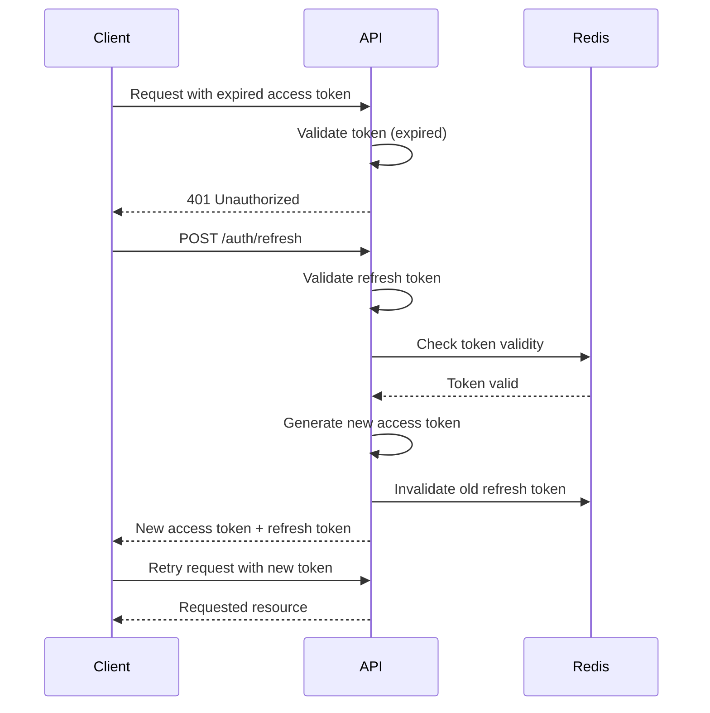

# JWT Authentication Strategy

## Table of Contents
1. [Overview](#overview)
2. [JWT Structure](#jwt-structure)
3. [Token Types](#token-types)
4. [Token Generation](#token-generation)
5. [Token Validation](#token-validation)
6. [Token Refresh Flow](#token-refresh-flow)
7. [Security Considerations](#security-considerations)
8. [Implementation in Go](#implementation-in-go)
9. [Error Handling](#error-handling)
10. [Testing](#testing)
11. [Related Documents](#related-documents)
12. [Version History](#version-history)

## Overview

This document outlines the JWT (JSON Web Token) authentication strategy for the Global Remit backend. JWT is used for stateless authentication between the client and server, providing a secure way to transmit information between parties as a JSON object.

### Key Features

- Stateless authentication
- Support for access and refresh tokens
- Role-based access control
- Token expiration and refresh mechanism
- Secure token storage and transmission

## JWT Structure

### Header
```json
{
  "alg": "RS256",
  "typ": "JWT"
}
```

### Payload
```json
{
  "sub": "1234567890",
  "name": "John Doe",
  "role": "teller",
  "branch_id": "BR123",
  "iat": 1516239022,
  "exp": 1516242622,
  "jti": "unique-token-identifier"
}
```

### Signature
```
HMACSHA256(
  base64UrlEncode(header) + "." +
  base64UrlEncode(payload),
  secret
)
```

## Token Types

### Access Token
- Short-lived (15 minutes)
- Used for API authentication
- Contains user claims and permissions
- Stored in memory (not localStorage)

### Refresh Token
- Longer-lived (7 days)
- Used to obtain new access tokens
- Stored in HTTP-only, Secure, SameSite cookie
- Can be revoked

### ID Token (for OIDC)
- Contains user profile information
- Used for client-side user identification
- Validated against the IDP's public keys

## Token Generation

### Key Management
- Use RSA-256 (asymmetric) for signing tokens
- Private key stored securely (AWS KMS, HashiCorp Vault)
- Public key distributed to verify tokens

### Token Generation Process
1. Generate unique JTI (JWT ID) for tracking
2. Set appropriate expiration times
3. Include necessary claims (sub, roles, permissions)
4. Sign with private key
5. Return to client in secure manner

## Token Validation

### Validation Steps
1. Verify token signature
2. Check token expiration
3. Validate issuer (iss) and audience (aud) claims
4. Verify token is not in the revocation list
5. Check token scope matches requested resource

### Revocation Strategy
- Maintain a Redis blacklist of revoked tokens
- Check token ID (jti) against blacklist on each request
- Remove expired tokens from blacklist during cleanup

## Token Refresh Flow



## Security Considerations

### Token Storage
- **Access Token**: In-memory (JavaScript)
- **Refresh Token**: HTTP-only, Secure, SameSite cookie
- **Never store tokens in localStorage or sessionStorage**

### Token Transmission
- Always use HTTPS
- Include tokens in Authorization header
- Set appropriate CORS headers
- Use secure cookie attributes

### Token Expiration
- Access token: 15 minutes
- Refresh token: 7 days
- ID token: 1 hour

## Implementation in Go

### Dependencies
```go
import (
    "github.com/golang-jwt/jwt/v5"
    "time"
)
```

### Token Generation

```go
type CustomClaims struct {
    UserID   string `json:"user_id"`
    Role     string `json:"role"`
    BranchID string `json:"branch_id,omitempty"`
    jwt.RegisteredClaims
}

func GenerateTokenPair(user *models.User) (map[string]string, error) {
    // Create access token
    accessToken := jwt.NewWithClaims(jwt.SigningMethodRS256, CustomClaims{
        UserID:   user.ID,
        Role:     user.Role,
        BranchID: user.BranchID,
        RegisteredClaims: jwt.RegisteredClaims{
            ExpiresAt: jwt.NewNumericDate(time.Now().Add(15 * time.Minute)),
            IssuedAt:  jwt.NewNumericDate(time.Now()),
            Issuer:    "global-remit-api",
            Subject:   user.ID,
            ID:        uuid.New().String(),
        },
    })

    // Sign token with private key
    accessTokenString, err := accessToken.SignedString(privateKey)
    if err != nil {
        return nil, fmt.Errorf("error signing access token: %w", err)
    }

    // Create refresh token
    refreshToken := jwt.NewWithClaims(jwt.SigningMethodRS256, jwt.RegisteredClaims{
        ExpiresAt: jwt.NewNumericDate(time.Now().Add(7 * 24 * time.Hour)),
        IssuedAt:  jwt.NewNumericDate(time.Now()),
        Issuer:    "global-remit-api",
        Subject:   user.ID,
        ID:        uuid.New().String(),
    })

    refreshTokenString, err := refreshToken.SignedString(privateKey)
    if err != nil {
        return nil, fmt.Errorf("error signing refresh token: %w", err)
    }

    return map[string]string{
        "access_token":  accessTokenString,
        "refresh_token": refreshTokenString,
        "token_type":    "Bearer",
        "expires_in":    "900", // 15 minutes in seconds
    }, nil
}
```

### Token Validation Middleware

```go
func JWTMiddleware(next http.Handler) http.Handler {
    return http.HandlerFunc(func(w http.ResponseWriter, r *http.Request) {
        // Extract token from Authorization header
        authHeader := r.Header.Get("Authorization")
        if authHeader == "" {
            respondWithError(w, http.StatusUnauthorized, "Authorization header required")
            return
        }

        // Check token format
        parts := strings.Split(authHeader, " ")
        if len(parts) != 2 || parts[0] != "Bearer" {
            respondWithError(w, http.StatusUnauthorized, "Invalid token format")
            return
        }

        tokenString := parts[1]

        // Parse and validate token
        token, err := jwt.ParseWithClaims(tokenString, &CustomClaims{}, func(token *jwt.Token) (interface{}, error) {
            // Validate algorithm
            if _, ok := token.Method.(*jwt.SigningMethodRSA); !ok {
                return nil, fmt.Errorf("unexpected signing method: %v", token.Header["alg"])
            }
            return publicKey, nil
        })

        if err != nil {
            respondWithError(w, http.StatusUnauthorized, "Invalid token: "+err.Error())
            return
        }

        // Check if token is valid
        if claims, ok := token.Claims.(*CustomClaims); ok && token.Valid {
            // Add claims to context
            ctx := context.WithValue(r.Context(), "user_claims", claims)
            next.ServeHTTP(w, r.WithContext(ctx))
        } else {
            respondWithError(w, http.StatusUnauthorized, "Invalid token")
        }
    })
}
```

### Refresh Token Endpoint

```go
func RefreshTokenHandler(w http.ResponseWriter, r *http.Request) {
    // Extract refresh token from cookie
    cookie, err := r.Cookie("refresh_token")
    if err != nil {
        respondWithError(w, http.StatusBadRequest, "Refresh token required")
        return
    }

    refreshTokenString := cookie.Value

    // Parse and validate refresh token
    token, err := jwt.ParseWithClaims(refreshTokenString, &jwt.RegisteredClaims{}, 
        func(token *jwt.Token) (interface{}, error) {
            if _, ok := token.Method.(*jwt.SigningMethodRSA); !ok {
                return nil, fmt.Errorf("unexpected signing method: %v", token.Header["alg"])
            }
            return publicKey, nil
        })

    if err != nil || !token.Valid {
        respondWithError(w, http.StatusUnauthorized, "Invalid refresh token")
        return
    }

    claims, ok := token.Claims.(*jwt.RegisteredClaims)
    if !ok {
        respondWithError(w, http.StatusInternalServerError, "Invalid token claims")
        return
    }

    // Check if token is in blacklist
    if isTokenRevoked(claims.ID) {
        respondWithError(w, http.StatusUnauthorized, "Token has been revoked")
        return
    }

    // Get user from database
    user, err := models.GetUserByID(claims.Subject)
    if err != nil {
        respondWithError(w, http.StatusUnauthorized, "User not found")
        return
    }

    // Generate new token pair
    tokens, err := GenerateTokenPair(user)
    if err != nil {
        respondWithError(w, http.StatusInternalServerError, "Error generating tokens")
        return
    }

    // Set refresh token in HTTP-only cookie
    http.SetCookie(w, &http.Cookie{
        Name:     "refresh_token",
        Value:    tokens["refresh_token"],
        Path:     "/",
        HttpOnly: true,
        Secure:   true,
        SameSite: http.SameSiteStrictMode,
        MaxAge:   7 * 24 * 3600, // 7 days
    })

    // Return new access token
    respondWithJSON(w, http.StatusOK, map[string]string{
        "access_token": tokens["access_token"],
        "token_type":   "Bearer",
        "expires_in":   "900",
    })
}
```

## Error Handling

### Common JWT Errors

| Error | Status Code | Description |
|-------|-------------|-------------|
| Missing token | 401 | No token provided |
| Invalid token | 401 | Malformed or invalid token |
| Expired token | 401 | Token has expired |
| Invalid signature | 401 | Token signature is invalid |
| Insufficient permissions | 403 | User lacks required permissions |
| Token revoked | 401 | Token has been revoked |

### Error Response Format

```json
{
  "error": {
    "code": "invalid_token",
    "message": "Token has expired",
    "details": "The access token provided has expired"
  },
  "timestamp": "2025-06-20T16:30:00Z"
}
```

## Testing

### Unit Tests

```go
func TestTokenGeneration(t *testing.T) {
    user := &models.User{
        ID:       "user123",
        Email:    "test@example.com",
        Role:     "teller",
        BranchID: "BR123",
    }

    tokens, err := GenerateTokenPair(user)
    if err != nil {
        t.Fatalf("Error generating tokens: %v", err)
    }

    // Verify access token
    accessToken, err := jwt.ParseWithClaims(tokens["access_token"], &CustomClaims{}, 
        func(token *jwt.Token) (interface{}, error) {
            return publicKey, nil
        })
    
    if err != nil || !accessToken.Valid {
        t.Fatalf("Invalid access token: %v", err)
    }

    claims, ok := accessToken.Claims.(*CustomClaims)
    if !ok {
        t.Fatal("Invalid claims type")
    }

    if claims.UserID != user.ID || claims.Role != user.Role {
        t.Error("Token claims do not match user data")
    }
}

func TestTokenValidation(t *testing.T) {
    // Test valid token
    // Test expired token
    // Test invalid signature
    // Test missing required claims
}
```

### Integration Tests

```go
func TestRefreshTokenFlow(t *testing.T) {
    // 1. Login to get initial tokens
    // 2. Use refresh token to get new access token
    // 3. Verify new access token works
    // 4. Verify old access token is invalidated
}

func TestAccessControl(t *testing.T) {
    // Test role-based access control
    // Test permission-based access control
    // Test branch-based access control
}
```

## Related Documents
- [Authentication Overview](./060-AUTH-OVERVIEW.md)
- [Next.js Auth Integration](./061-NEXTJS-AUTH-INTEGRATION.md)
- [Session Management](./063-SESSION-MANAGEMENT.md)
- [Role-Based Access Control](./064-ROLE-BASED-ACCESS-CONTROL.md)
- [OAuth Integration](./065-OAUTH-INTEGRATION.md)
- [Multi-Factor Authentication](./067-MULTI-FACTOR-AUTH.md)

## Version History
| Date | Version | Description |
|------|---------|-------------|
| 2025-06-20 | 1.0 | Initial version |
