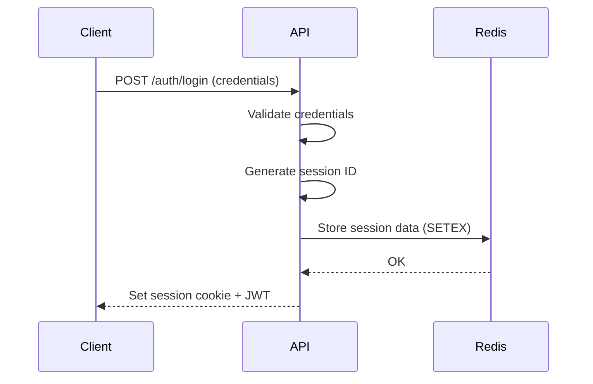
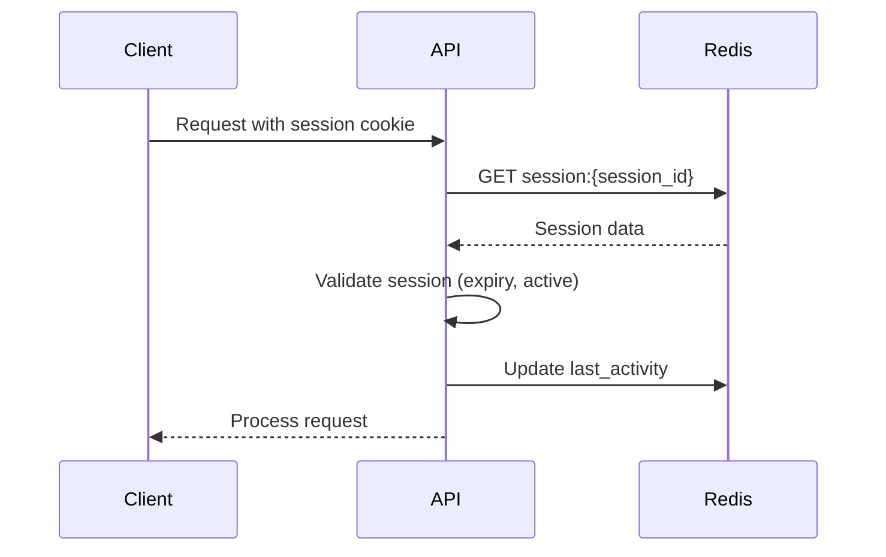

# Session Management

## Table of Contents
1. [Overview](#overview)
2. [Session Storage](#session-storage)
3. [Session Lifecycle](#session-lifecycle)
4. [Security Considerations](#security-considerations)
5. [Distributed Sessions](#distributed-sessions)
6. [Session Data Management](#session-data-management)
7. [Implementation in Go](#implementation-in-go)
8. [Redis Integration](#redis-integration)
9. [Monitoring and Logging](#monitoring-and-logging)
10. [Error Handling](#error-handling)
11. [Testing](#testing)
12. [Related Documents](#related-documents)
13. [Version History](#version-history)

## Overview

This document outlines the session management strategy for the Global Remit application. It covers how user sessions are created, maintained, and destroyed, with a focus on security, scalability, and performance.

### Key Features

- Stateless JWT-based sessions
- Redis-backed session store
- Configurable session timeouts
- Concurrent session control
- Session activity tracking
- Secure session storage

## Session Storage

### Session Data Structure

```go
type Session struct {
    ID           string                 `json:"id"`
    UserID       string                 `json:"user_id"`
    Email        string                 `json:"email"`
    Role         string                 `json:"role"`
    BranchID     string                 `json:"branch_id,omitempty"`
    IPAddress    string                 `json:"ip_address"`
    UserAgent    string                 `json:"user_agent"`
    CreatedAt    time.Time              `json:"created_at"`
    LastActivity time.Time              `json:"last_activity"`
    ExpiresAt    time.Time              `json:"expires_at"`
    Metadata     map[string]interface{} `json:"metadata,omitempty"`
}
```

### Storage Backend: Redis

- **Key Format**: `session:{session_id}`
- **Data Serialization**: JSON
- **Expiration**: Automatic TTL based on session timeout
- **Partitioning**: By user ID for efficient querying

## Session Lifecycle

### 1. Session Creation



### 2. Session Validation



### 3. Session Termination

- **Logout**: Explicit session termination
- **Timeout**: Inactivity timeout
- **Max Duration**: Absolute session lifetime
- **Global Logout**: Terminate all user sessions

## Security Considerations

### Session Fixation Prevention
- Generate new session ID on login
- Invalidate previous sessions if needed
- Regenerate session ID on privilege change

### Session Hijacking Protection
- Secure, HTTP-only cookies
- SameSite cookie attribute
- IP binding (optional)
- User-Agent verification

### Session Timeout Policies

| Timeout Type | Duration | Description |
|--------------|----------|-------------|
| Idle Timeout | 30 min | Session expires after inactivity |
| Absolute Timeout | 8 hours | Maximum session duration |
| Remember Me | 7 days | Extended session with "Remember Me" |
| Token Expiry | 15 min | Access token lifetime |

## Distributed Sessions

### Redis Cluster Configuration

```yaml
# redis-cluster-config.yaml
cluster:
  enabled: true
  nodes:
    - redis-node-1:6379
    - redis-node-2:6379
    - redis-node-3:6379
  replication: true
  failover: true
  connection_pool:
    size: 10
    idle_timeout: 5m
```

### Session Replication
- Asynchronous replication between Redis nodes
- Read replicas for high availability
- Automatic failover with Redis Sentinel

## Session Data Management

### Data Retention
- Active sessions: Stored in Redis
- Session history: Archived to database
- Audit logs: Stored for compliance

### Session Cleanup
- Automatic TTL-based expiration in Redis
- Background job for orphaned sessions
- Regular cleanup of expired sessions

## Implementation in Go

### Session Manager Interface

```go
type SessionManager interface {
    // Core session operations
    Create(ctx context.Context, user *models.User, ip, userAgent string) (*Session, error)
    Get(ctx context.Context, sessionID string) (*Session, error)
    Delete(ctx context.Context, sessionID string) error
    Refresh(ctx context.Context, sessionID string) (*Session, error)
    
    // User session management
    ListUserSessions(ctx context.Context, userID string) ([]*Session, error)
    RevokeUserSessions(ctx context.Context, userID string, keepCurrent bool) error
    
    // Maintenance
    CleanupExpiredSessions(ctx context.Context) (int64, error)
    
    // Metrics
    GetSessionCount(ctx context.Context) (int64, error)
    GetActiveUserCount(ctx context.Context) (int64, error)
}
```

### Session Middleware

```go
func SessionMiddleware(sm SessionManager) func(http.Handler) http.Handler {
    return func(next http.Handler) http.Handler {
        return http.HandlerFunc(func(w http.ResponseWriter, r *http.Request) {
            // Extract session ID from cookie or header
            sessionID, err := extractSessionID(r)
            if err != nil {
                next.ServeHTTP(w, r)
                return
            }
            
            // Get session from store
            session, err := sm.Get(r.Context(), sessionID)
            if err != nil {
                clearSessionCookie(w)
                respondWithError(w, http.StatusUnauthorized, "Invalid or expired session")
                return
            }
            
            // Check session expiration
            if time.Now().After(session.ExpiresAt) {
                _ = sm.Delete(r.Context(), sessionID)
                clearSessionCookie(w)
                respondWithError(w, http.StatusUnauthorized, "Session expired")
                return
            }
            
            // Update last activity
            session.LastActivity = time.Now()
            if err := sm.Store.Update(r.Context(), session); err != nil {
                log.Printf("Failed to update session activity: %v", err)
            }
            
            // Add session to context
            ctx := context.WithValue(r.Context(), "session", session)
            next.ServeHTTP(w, r.WithContext(ctx))
        })
    }
}
```

## Redis Integration

### Session Store Implementation

```go
type RedisSessionStore struct {
    client *redis.ClusterClient
    ttl    time.Duration
}

func NewRedisSessionStore(addrs []string, password string, ttl time.Duration) (*RedisSessionStore, error) {
    client := redis.NewClusterClient(&redis.ClusterOptions{
        Addrs:         addrs,
        Password:      password,
        RouteRandomly: true,
        PoolSize:      10,
        MinIdleConns:  5,
        DialTimeout:   5 * time.Second,
        ReadTimeout:   3 * time.Second,
        WriteTimeout:  3 * time.Second,
        PoolTimeout:   4 * time.Second,
    })

    // Test connection
    if err := client.Ping(context.Background()).Err(); err != nil {
        return nil, fmt.Errorf("failed to connect to Redis: %w", err)
    }

    return &RedisSessionStore{
        client: client,
        ttl:    ttl,
    }, nil
}

func (s *RedisSessionStore) Save(ctx context.Context, session *Session) error {
    data, err := json.Marshal(session)
    if err != nil {
        return fmt.Errorf("failed to marshal session: %w", err)
    }

    key := fmt.Sprintf("session:%s", session.ID)
    ttl := time.Until(session.ExpiresAt)
    
    if err := s.client.Set(ctx, key, data, ttl).Err(); err != nil {
        return fmt.Errorf("failed to save session to Redis: %w", err)
    }
    
    return nil
}

func (s *RedisSessionStore) Find(ctx context.Context, sessionID string) (*Session, error) {
    key := fmt.Sprintf("session:%s", sessionID)
    data, err := s.client.Get(ctx, key).Bytes()
    if err == redis.Nil {
        return nil, ErrSessionNotFound
    } else if err != nil {
        return nil, fmt.Errorf("failed to get session from Redis: %w", err)
    }

    var session Session
    if err := json.Unmarshal(data, &session); err != nil {
        return nil, fmt.Errorf("failed to unmarshal session: %w", err)
    }

    return &session, nil
}
```

## Monitoring and Logging

### Key Metrics

| Metric | Type | Description |
|--------|------|-------------|
| `sessions_active` | Gauge | Current number of active sessions |
| `session_logins_total` | Counter | Total number of logins |
| `session_errors_total` | Counter | Number of session errors |
| `session_duration_seconds` | Histogram | Duration of sessions |
| `session_cleanup_deleted` | Counter | Number of sessions cleaned up |

### Audit Logging

```go
func (s *SessionManager) logSessionEvent(eventType string, session *Session) {
    event := map[string]interface{}{
        "timestamp":     time.Now().UTC(),
        "event_type":    eventType,
        "session_id":    session.ID,
        "user_id":       session.UserID,
        "ip_address":    session.IPAddress,
        "user_agent":    session.UserAgent,
        "session_start": session.CreatedAt,
        "last_activity": session.LastActivity,
    }

    // Send to logging system
    logJSON, _ := json.Marshal(event)
    s.logger.Info(string(logJSON))
    
    // Optionally send to audit log service
    go s.auditLogger.Log(event)
}
```

## Error Handling

### Common Errors

| Error | Status Code | Description |
|-------|-------------|-------------|
| `ErrSessionNotFound` | 401 | Session does not exist |
| `ErrSessionExpired` | 401 | Session has expired |
| `ErrSessionInvalid` | 401 | Session is invalid |
| `ErrTooManySessions` | 403 | Maximum concurrent sessions reached |
| `ErrSessionRevoked` | 401 | Session was revoked |

### Error Responses

```json
{
  "error": {
    "code": "session_expired",
    "message": "Your session has expired",
    "details": "Please log in again to continue"
  },
  "timestamp": "2025-06-20T16:30:00Z"
}
```

## Testing

### Unit Tests

```go
func TestSessionManager_CreateAndGet(t *testing.T) {
    // Setup
    ctx := context.Background()
    store, cleanup := setupTestRedis(t)
    defer cleanup()
    
    sm := NewSessionManager(store, testConfig)
    
    // Test
    user := &models.User{
        ID:    "user123",
        Email: "test@example.com",
        Role:  "teller",
    }
    
    session, err := sm.Create(ctx, user, "192.168.1.1", "test-agent")
    require.NoError(t, err)
    require.NotEmpty(t, session.ID)
    require.Equal(t, user.ID, session.UserID)
    
    // Verify session can be retrieved
    found, err := sm.Get(ctx, session.ID)
    require.NoError(t, err)
    require.Equal(t, session.ID, found.ID)
    require.Equal(t, user.ID, found.UserID)
}

func TestSessionManager_ConcurrentAccess(t *testing.T) {
    // Test concurrent session creation and access
    // Ensure no race conditions or deadlocks
}
```

### Integration Tests

```go
func TestSessionFlow(t *testing.T) {
    // Test complete session lifecycle:
    // 1. Create session
    // 2. Access protected resource
    // 3. Refresh session
    // 4. Logout
    // 5. Verify session is invalid
}

func TestSessionSecurity(t *testing.T) {
    // Test session fixation
    // Test session hijacking protection
    // Test concurrent session limits
}
```

## Related Documents
- [Authentication Overview](./060-AUTH-OVERVIEW.md)
- [JWT Strategy](./062-JWT-STRATEGY.md)
- [Next.js Auth Integration](./061-NEXTJS-AUTH-INTEGRATION.md)
- [Role-Based Access Control](./064-ROLE-BASED-ACCESS-CONTROL.md)
- [Redis Strategy](../4. Redis (060-079)/060-REDIS-STRATEGY.md)

## Version History
| Date | Version | Description |
|------|---------|-------------|
| 2025-06-20 | 1.0 | Initial version |
