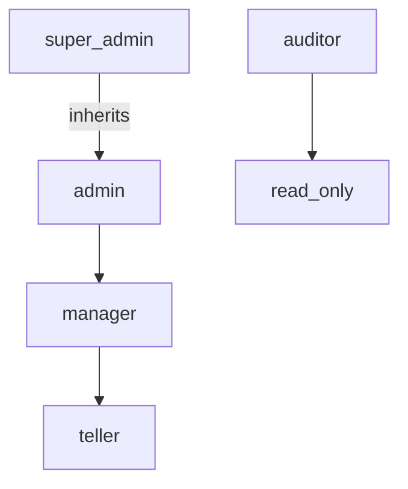

# Role-Based Access Control (RBAC)

## Table of Contents
1. [Overview](#overview)
2. [Core Concepts](#core-concepts)
3. [Role Definitions](#role-definitions)
4. [Permission Model](#permission-model)
5. [Implementation in Go](#implementation-in-go)
6. [Middleware Integration](#middleware-integration)
7. [Frontend Integration](#frontend-integration)
8. [Testing](#testing)
9. [Performance Considerations](#performance-considerations)
10. [Security Considerations](#security-considerations)
11. [Related Documents](#related-documents)
12. [Version History](#version-history)

## Overview

This document outlines the Role-Based Access Control (RBAC) system for the Global Remit application. RBAC is used to control access to resources based on the roles of individual users within the organization.

### Key Features

- Fine-grained permission control
- Role inheritance and composition
- Resource-based access rules
- Permission caching for performance
- Audit logging of access control decisions

## Core Concepts

### Roles
Predefined sets of permissions that can be assigned to users. Roles are hierarchical and can inherit permissions from other roles.

### Permissions
Atomic actions that can be performed on resources (e.g., `transactions:create`, `users:read`).

### Resources
Protected entities in the system (e.g., `transactions`, `users`, `reports`).

### Scopes
Contextual boundaries for permissions (e.g., `branch:123`, `region:emea`).

## Role Definitions

### System Roles

| Role | Description | Inherits From |
|------|-------------|----------------|
| `super_admin` | Full system access | - |
| `admin` | Administrative access | - |
| `manager` | Branch/team management | `teller` |
| `teller` | Standard teller | - |
| `auditor` | Read-only access to all data | - |

### Role Hierarchy



## Permission Model

### Permission Format

```
{resource}:{action}:{scope?}
```

### Permission Examples

| Permission | Description |
|------------|-------------|
| `transactions:create` | Create new transactions |
| `transactions:read:branch` | View transactions in user's branch |
| `users:update:branch` | Update users in user's branch |
| `reports:generate` | Generate reports |

### Role-Permission Mapping

```yaml
roles:
  teller:
    permissions:
      - "transactions:create"
      - "transactions:read:branch"
      - "clients:read:branch"
      - "accounts:read:branch"
      - "transactions:update:own"

  manager:
    inherits: ["teller"]
    permissions:
      - "transactions:approve:branch"
      - "users:read:branch"
      - "reports:generate:branch"

  admin:
    permissions:
      - "*:*"  # Wildcard for all permissions
```

## Implementation in Go

### Data Models

```go
// Permission represents a single permission
type Permission string

// Role defines a role with its permissions
type Role struct {
    ID          string       `json:"id"`
    Name        string       `json:
ame"`
    Description string       `json:"description"`
    Permissions []Permission `json:"permissions"`
    Inherits    []string     `json:"inherits"`
}

// User represents a system user with roles
type User struct {
    ID       string   `json:"id"`
    Email    string   `json:"email"`
    Roles    []string `json:"roles"`
    BranchID string   `json:ranch_id"`
    // Other user fields...
}

// PermissionCheck represents the context for a permission check
type PermissionCheck struct {
    Resource  string      `json:"resource"`
    Action    string      `json:"action"`
    Scope     string      `json:"scope,omitempty"`
    User      *User       `json:"user"`
    ResourceOwnerID string   `json:"resource_owner_id,omitempty"`
}
```

### Permission Service

```go
// PermissionService handles RBAC operations
type PermissionService struct {
    roles       map[string]Role
    cache       *ristretto.Cache
    logger      *zap.Logger
}

// NewPermissionService creates a new PermissionService
func NewPermissionService(roles []Role) (*PermissionService, error) {
    cache, err := ristretto.NewCache(&ristretto.Config{
        NumCounters: 1e7,     // Number of keys to track frequency of (10M).
        MaxCost:     1 << 30, // Maximum cost of cache (1GB).
        BufferItems: 64,      // Number of keys per Get buffer.
    })
    if err != nil {
        return nil, fmt.Errorf("failed to create cache: %w", err)
    }

    roleMap := make(map[string]Role)
    for _, role := range roles {
        roleMap[role.ID] = role
    }

    return &PermissionService{
        roles:  roleMap,
        cache:  cache,
        logger: zap.NewNop(), // Replace with your logger
    }, nil
}

// HasPermission checks if a user has the required permission
func (s *PermissionService) HasPermission(ctx context.Context, check PermissionCheck) (bool, error) {
    cacheKey := s.cacheKey(check)
    
    // Check cache first
    if cached, found := s.cache.Get(cacheKey); found {
        return cached.(bool), nil
    }
    
    // Check each role for the required permission
    for _, roleID := range check.User.Roles {
        role, exists := s.roles[roleID]
        if !exists {
            continue
        }
        
        // Check direct permissions
        if s.hasPermissionInRole(role, check) {
            s.cache.SetWithTTL(cacheKey, true, 1, 5*time.Minute)
            return true, nil
        }
        
        // Check inherited roles
        for _, inheritedRoleID := range role.Inherits {
            if inheritedRole, exists := s.roles[inheritedRoleID]; exists {
                if s.hasPermissionInRole(inheritedRole, check) {
                    s.cache.SetWithTTL(cacheKey, true, 1, 5*time.Minute)
                    return true, nil
                }
            }
        }
    }
    
    s.cache.SetWithTTL(cacheKey, false, 1, 5*time.Minute)
    return false, nil
}

// hasPermissionInRole checks if a role has the required permission
func (s *PermissionService) hasPermissionInRole(role Role, check PermissionCheck) bool {
    requiredPerm := Permission(fmt.Sprintf("%s:%s", check.Resource, check.Action))
    
    for _, perm := range role.Permissions {
        // Check for wildcard permission
        if perm == "*:*" || perm == "*" {
            return true
        }
        
        // Check exact match
        if perm == requiredPerm {
            return true
        }
        
        // Check resource wildcard (e.g., "transactions:*")
        if strings.HasSuffix(string(perm), ":*") && 
           strings.HasPrefix(string(perm), check.Resource + ":") {
            return true
        }
    }
    
    return false
}

// cacheKey generates a cache key for a permission check
func (s *PermissionService) cacheKey(check PermissionCheck) string {
    return fmt.Sprintf("%s:%s:%s:%s", 
        check.User.ID, 
        check.Resource, 
        check.Action, 
        check.Scope)
}
```

## Middleware Integration

### Permission Middleware

```go
// RequirePermission middleware checks if the user has the required permission
func RequirePermission(ps *PermissionService, resource, action string) func(http.Handler) http.Handler {
    return func(next http.Handler) http.Handler {
        return http.HandlerFunc(func(w http.ResponseWriter, r *http.Request) {
            // Get user from context (set by auth middleware)
            user, ok := r.Context().Value("user").(*User)
            if !ok || user == nil {
                respondWithError(w, http.StatusUnauthorized, "Authentication required")
                return
            }
            
            // Get scope from request context (e.g., branch ID)
            scope := ""
            if branchID, ok := r.Context().Value("branch_id").(string); ok {
                scope = branchID
            }
            
            // Check permission
            hasPermission, err := ps.HasPermission(r.Context(), PermissionCheck{
                Resource: resource,
                Action:   action,
                Scope:    scope,
                User:     user,
            })
            
            if err != nil {
                s.logger.Error("Permission check failed", 
                    zap.Error(err), 
                    zap.String("resource", resource),
                    zap.String("action", action),
                    zap.String("user_id", user.ID))
                respondWithError(w, http.StatusInternalServerError, "Internal server error")
                return
            }
            
            if !hasPermission {
                s.logger.Warn("Permission denied", 
                    zap.String("resource", resource),
                    zap.String("action", action),
                    zap.String("user_id", user.ID))
                respondWithError(w, http.StatusForbidden, "Insufficient permissions")
                return
            }
            
            next.ServeHTTP(w, r)
        })
    }
}
```

### Route Protection Example

```go
// Example route with RBAC protection
router := mux.NewRouter()

// Public routes
router.HandleFunc("/health", healthCheckHandler)

// Protected API routes
api := router.PathPrefix("/api").Subrouter()
api.Use(authMiddleware) // JWT auth
api.Use(branchMiddleware) // Extract branch context

// Transaction routes
txRouter := api.PathPrefix("/transactions").Subrouter()
txRouter.HandleFunc("", createTransactionHandler).Methods("POST")
txRouter.HandleFunc("", listTransactionsHandler).Methods("GET")
txRouter.HandleFunc("/{id}", getTransactionHandler).Methods("GET")
txRouter.HandleFunc("/{id}/approve", approveTransactionHandler).Methods("POST")

// Apply RBAC middleware
txRouter.Use(middleware.RequirePermission(permissionService, "transactions", "read"))
txRouter.Methods("POST").Handler(
    middleware.RequirePermission(permissionService, "transactions", "create")(
        txRouter.Methods("POST").HandlerFunc(createTransactionHandler).Handler))
txRouter.Methods("POST").Path("/{id}/approve").Handler(
    middleware.RequirePermission(permissionService, "transactions", "approve")(
        txRouter.Methods("POST").Path("/{id}/approve").HandlerFunc(approveTransactionHandler).Handler))
```

## Frontend Integration

### Permission Hooks

```tsx
// hooks/usePermissions.ts
import { useSession } from 'next-auth/react';

export function usePermissions() {
  const { data: session } = useSession();
  
  const hasPermission = (resource: string, action: string, scope?: string): boolean => {
    if (!session?.user?.permissions) return false;
    
    // Check for wildcard permission
    if (session.user.permissions.includes('*:*')) return true;
    
    // Check exact permission
    const exactPermission = `${resource}:${action}`;
    if (session.user.permissions.includes(exactPermission)) return true;
    
    // Check resource wildcard
    const resourceWildcard = `${resource}:*`;
    if (session.user.permissions.includes(resourceWildcard)) return true;
    
    return false;
  };
  
  return { hasPermission };
}

// Example component
const TransactionList = () => {
  const { hasPermission } = usePermissions();
  const canCreate = hasPermission('transactions', 'create');
  
  return (
    <div>
      <h1>Transactions</h1>
      {canCreate && (
        <button onClick={() => createTransaction()}>
          New Transaction
        </button>
      )}
      {/* Transaction list */}
    </div>
  );
};
```

## Testing

### Unit Tests

```go
func TestPermissionService(t *testing.T) {
    // Setup test roles
    roles := []Role{
        {
            ID:   "teller",
            Name: "Teller",
            Permissions: []Permission{
                "transactions:create",
                "transactions:read:branch",
            },
        },
        {
            ID:       "manager",
            Name:     "Manager",
            Inherits: []string{"teller"},
            Permissions: []Permission{
                "transactions:approve:branch",
            },
        },
    }
    
    ps, err := NewPermissionService(roles)
    require.NoError(t, err)
    
    tests := []struct {
        name       string
        user       *User
        permission PermissionCheck
        want       bool
    }{
        {
            name: "Teller can create transactions",
            user: &User{
                ID:    "user1",
                Roles: []string{"teller"},
            },
            permission: PermissionCheck{
                Resource: "transactions",
                Action:   "create",
            },
            want: true,
        },
        {
            name: "Manager inherits teller permissions",
            user: &User{
                ID:    "user2",
                Roles: []string{"manager"},
            },
            permission: PermissionCheck{
                Resource: "transactions",
                Action:   "create",
            },
            want: true,
        },
        // More test cases...
    }
    
    for _, tt := range tests {
        t.Run(tt.name, func(t *testing.T) {
            got, err := ps.HasPermission(context.Background(), tt.permission)
            require.NoError(t, err)
            assert.Equal(t, tt.want, got)
        })
    }
}
```

## Performance Considerations

### Caching Strategy
- Cache permission checks with a TTL of 5 minutes
- Invalidate cache on role/permission changes
- Use efficient cache key generation

### Query Optimization
- Preload user roles and permissions
- Use efficient data structures for permission checks
- Consider denormalization for frequently accessed permissions

## Security Considerations

### Principle of Least Privilege
- Assign minimum required permissions
- Regularly audit role assignments
- Implement role expiration

### Audit Logging
- Log all permission denials
- Track permission changes
- Monitor for unusual access patterns

## Related Documents
- [Authentication Overview](./060-AUTH-OVERVIEW.md)
- [JWT Strategy](./062-JWT-STRATEGY.md)
- [Session Management](./063-SESSION-MANAGEMENT.md)
- [Next.js Auth Integration](./061-NEXTJS-AUTH-INTEGRATION.md)
- [API Security Guidelines](../7. API (120-139)/120-API-SECURITY.md)

## Version History
| Date | Version | Description |
|------|---------|-------------|
| 2025-06-20 | 1.0 | Initial version |
